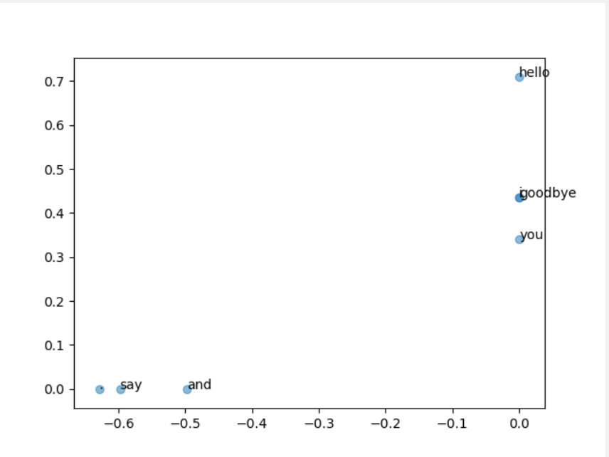

## 自然语言和单词的分布式表示
### 什么是自然语言处理
所谓自然语言处理（Natural Language Processing，NLP），就是处理自然语言的科学。

一些巧妙地蕴含了单词含义的表示方法。
- 基于同义词词典的方法
- 基于计数的方法
- 基于推理的方法（word2vec）

### 同义词词典
例如car的同义词
```
car = auto automobile machine motorcar
```
有时会定义单词之间的粒度 更细的关系，比如“上位 - 下位”关系、“整体 - 部分”关系


#### WordNet
WordNet 是普林斯顿大学于 1985 年开始开发的同义词词典，迄今已用于许多研究。
> 在附录 B 中，会安装 WordNet（准确地说，是安装 NLTK 模块），并进行一些简单的实验。

#### 同义词词典的问题

WordNet 等同义词词典中对大量单词定义了同义词和层级结构关系等。
利用这些知识，可以（间接地）让计算机理解单词含义。

> 问题1：难以顺应时代变化

语言的含义也会随着时间的推移而变化。

> 问题2：人力成本高

制作词典需要巨大的人力成本。

> 问题3：无法表示单词的微妙差异

即使是含义相近的单词，也有细微的差别。

所以，一般而言，不会使用同义词词典来解决问题。

> 从人工制作词典或设计
> 特征量的旧范式，向尽量减少人为干预的、仅从文本数据中获取最
> 终结果的新范式转移。

### 基于计数的方法

我们将使用语料库（corpus）。语料库就是大量的文本数据。

基于计数的方法的目标就是从这些富有实践知识的语料库中，自动且高效地提取本质。

> 可以给文本数据的各个单词标记词性。为了方便计算机处理，语料库通常会被结构化（比如，采用
> 树结构等数据形式）。这里，假定我们使用的语料库没有添加标签，
> 而是作为一个大的文本文件，只包含简单的文本数据。

创建单词 ID 和单词的对应表

```python
>>> word_to_id = {}
>>> id_to_word = {}
>>>
>>> for word in words:
... if word not in word_to_id:
... new_id = len(word_to_id)
... word_to_id[word] = new_id
... id_to_word[new_id] = word
```

最后，我们将单词列表转化为单词 ID 列表。

```python
>>> import numpy as np
>>> corpus = [word_to_id[w] for w in words]
>>> corpus = np.array(corpus)
>>> corpus
array([0, 1, 2, 3, 4, 1, 5, 6])
```

> src/common/util.py#preprocess 源代码参考

#### 分布式表示

接下来，我们将关注能准确把握单词含义的向量表示。在自然语言处理领域，这称为分布式表示。

> 可以类比于RGB(255,255,255)这种三维向量表示法。

#### 分布式假设

“某个单词的含义由它周围的单词形成”，称为分布式假设。

单词本身没有含义，单词含义由它所在的上下文（语境）形成。


我们将上
下文的大小（即周围的单词有多少个）称为窗口大小（window size）。窗口
大小为 1，上下文包含左右各 1 个单词；窗口大小为 2，上下文包含左右各
2 个单词。

> 简单起见，仅处理不考虑句子分隔符、左右单词数量相同的上下文。实际上，句子分隔符非常有必要。

#### 共现矩阵

```python
text = 'You say goodbye and I say hello.'
corpus, word_to_id, id_to_word = preprocess(text)

print(corpus)
# [0 1 2 3 4 1 5 6]

print(id_to_word)
# {0: 'you', 1: 'say', 2: 'goodbye', 3: 'and', 4: 'i', 5: 'hello', 6:'.'}
```

词汇总数为 7 个。我们计算每个单词的
上下文所包含的单词的频数。在这个例子中，我们将窗口大小设为 1，从单
词 ID 为 0 的 you 开始。


因为图 2-7 的表格呈矩阵状，所以称为共现矩阵（co-occurence
matrix）。

封装函数reate_co_matrix(corpus,
vocab_size, window_size=1)，其中参数 corpus 是单词 ID 列表，参数 vocab_
size 是词汇个数，window_size 是窗口大小。

> common/util.py

```python
def create_co_matrix(corpus, vocab_size, window_size=1):
    """生成共现矩阵
    
    :param corpus: 语料库（单词ID列表）
    :param vocab_size:词汇个数
    :param window_size:窗口大小（当窗口大小为1时，左右各1个单词为上下文）
    :return: 共现矩阵
    """
    corpus_size = len(corpus)
    co_matrix = np.zeros((vocab_size, vocab_size), dtype=np.int32)

    for idx, word_id in enumerate(corpus):
        for i in range(1, window_size + 1):  # 在idx左右两边伸展
            left_idx = idx - i
            right_idx = idx + i

            if left_idx >= 0:
                left_word_id = corpus[left_idx]
                co_matrix[word_id, left_word_id] += 1

            if right_idx < corpus_size:
                right_word_id = corpus[right_idx]
                co_matrix[word_id, right_word_id] += 1

    return co_matrix
```

#### 向量间的相似度

在测量单词的向量
表示的相似度方面，使用余弦相似度（cosine similarity）。

设有
x = (x1, x2, x3, · · · , xn) 和 y = (y1, y2, y3, · · · , yn) 两个向量，它们之间的余弦相似度的定义
$$
\operatorname{similarity}(\boldsymbol{x}, \boldsymbol{y})=\frac{\boldsymbol{x} \cdot \boldsymbol{y}}{\|\boldsymbol{x}\|\|\boldsymbol{y}\|}=\frac{x_{1} y_{1}+\cdots+x_{n} y_{n}}{\sqrt{x_{1}^{2}+\cdots+x_{n}^{2}} \sqrt{y_{1}^{2}+\cdots+y_{n}^{2}}}
$$
分子是向量内积，分母是各个向量的范数。范数表示向量的大小，这里计算的是 L2 范数（即向量各个元素的平方和的平方根）。

要点是先对向量进行正规化，再求它们的内积。

> 两个向量完全指向相同的方向时，余弦相似度为 1；完全指向相反
> 的方向时，余弦相似度为 −1。

简单例子：src/ch02/similarity.py

#### 相似单词的排序

定义函数：most_similar(query, word_to_id, id_to_word, word_matrix, top=5)

| 参数名      | 说明                                                 |
| ----------- | ---------------------------------------------------- |
| query       | 查询词                                               |
| word_to_id  | 单词到单词 ID 的字典                                 |
| id_to_word  | 单词 ID 到单词的字典                                 |
| word_matrix | 汇总了单词向量的矩阵，假定保存了与各行对应的单词向量 |
| top         | 显示到前几位                                         |

> common.util.most_similar 实现
>
> src/ch02/most_similar.py 用例

### 基于计数的方法的改进

#### 点互信息

共现矩阵的元素表示两个单词同时出现的次数。但是，这种
“原始”的次数并不具备好的性质。

> 举例说明

考虑某个语料库中 the 和 car 共现的情况。我们会看到很多“...the car...”这样的短语。因此，它们的共现次数将会很大。另外，car 和 drive 也明显有很强的相关性。但是，如果只看单词的出
现次数，那么与 drive 相比，the 和 car 的相关性更强。这意味着，仅仅因
为 the 是个常用词，它就被认为与 car 有很强的相关性。

为了解决这一问题，可以使用点互信息（Pointwise Mutual Information，
PMI）这一指标。对于随机变量 x 和 y，它们的 PMI 定义如下
$$
\operatorname{PMI}(x, y)=\log _{2} \frac{P(x, y)}{P(x) P(y)} \tag{2.2}
$$
其中，P(x) 表示 x 发生的概率，P(y) 表示 y 发生的概率，P(x, y) 表示 x
和 y 同时发生的概率。PMI 的值越高，表明相关性越强。

> 可以这样理解：P(x,y)越大，而P(x)和P(y)都很小，说明x，y同时发生的概率很大，x,y单独发生的概率并不大。可以说明x和y关联性很高。此时，PMI的值也是递增的。

使用共现矩阵（其元素表示单词共现的次数）来重写式 (2.2)。
这里，将共现矩阵表示为 C，将单词 x 和 y 的共现次数表示为 C(x, y)，将
单词 x 和 y 的出现次数分别表示为 C(x)、C(y)，将语料库的单词数量记为
N，则式 (2.2) 可以重写为
$$
\operatorname{PMI}(x, y)=\log _{2} \frac{P(x, y)}{P(x) P(y)}=\log _{2} \frac{\frac{C(x, y)}{N}}{\frac{C(x)}{N} \frac{C(y)}{N}}=\log _{2} \frac{C(x, y) \cdot N}{C(x) C(y)}\tag{2.3}
$$
假设语料库的单词数量（N）为 10 000，the 出现 1000 次，car 出现 20 次，
drive 出现 10 次，the 和 car 共现 10 次，car 和 drive 共现 5 次。如果从共现次数的角度来看，则与 drive 相比，the 和 car 的相关性更强。而
如果从 PMI 的角度来看，来计算一下
$$
\begin{array}{l}
\mathrm{PMI}(\text { "the" }, \text { "car" })=\log _{2} \frac{10 \cdot 10000}{1000 \cdot 20} \approx 2.32 \\
\mathrm{PMI}(\text { "car", "drive" })=\log _{2} \frac{5 \cdot 10000}{20 \cdot 10} \approx 7.97
\end{array}
$$
结果表明，在使用 PMI 的情况下，与 the 相比，drive 和 car 具有更强
的相关性。

当两个单词的共现次数为 0 时，log20 = −∞。为了解决这个问题，
实践上我们会使用下述正的点互信息（Positive PMI，PPMI）。
$$
\operatorname{PPMI}(x, y)=\max (0, \operatorname{PMI}(x, y))
$$
当 PMI 是负数时，将其视为 0，这样就可以将单词间
的相关性表示为大于等于 0 的实数。

来实现将共现矩阵转化为
PPMI 矩阵的函数，这个函数称为 ppmi(C, verbose=False, eps=1e-8)。

```python
def ppmi(C, verbose=False, eps=1e-8):
    """生成PPMI（正的点互信息）

    :param C: 共现矩阵
    :param verbose: 是否输出进展情况
    :param eps: epsilon value
    :return:
    """
    # M仿照C的矩阵形状，全部初始化为0
    M = np.zeros_like(C, dtype=np.float32)
    # C中的1全部加起来就是N
    N = np.sum(C)
    # 由于C是共现矩阵，所以row num =col num，只计算axis=0即可
    S = np.sum(C, axis=0)
    total = C.shape[0] * C.shape[1]
    cnt = 0

    # 这里其实 i=j，否则无法解释下面的 S[j] * S[i]
    for i in range(C.shape[0]):
        for j in range(C.shape[1]):
            pmi = np.log2(C[i, j] * N / (S[j] * S[i]) + eps)
            M[i, j] = max(0, pmi)

            if verbose:
                cnt += 1
                if cnt % (total // 100 + 1) == 0:
                    print('%.1f%% done' % (100 * cnt / total))
    return M
```

$$
当单词 x 和 y 的共现次数为 \boldsymbol{C}(x, y) \text { 时 }, \boldsymbol{C}(x)=\sum_{i} \boldsymbol{C}(i, x), \boldsymbol{C}(y)=\sum_{i} \boldsymbol{C}(i, y)
\\
N=\sum_{i} \sum_{j} \boldsymbol{C}(i, j)
$$

以上是近似实现。例子参考：src/ch02/ppmi.py

```
covariance matrix
[[0 1 0 0 0 0 0]
 [1 0 1 0 1 1 0]
 [0 1 0 1 0 0 0]
 [0 0 1 0 1 0 0]
 [0 1 0 1 0 0 0]
 [0 1 0 0 0 0 1]
 [0 0 0 0 0 1 0]]
--------------------------------------------------
PPMI
[[0.    1.807 0.    0.    0.    0.    0.   ]
 [1.807 0.    0.807 0.    0.807 0.807 0.   ]
 [0.    0.807 0.    1.807 0.    0.    0.   ]
 [0.    0.    1.807 0.    1.807 0.    0.   ]
 [0.    0.807 0.    1.807 0.    0.    0.   ]
 [0.    0.807 0.    0.    0.    0.    2.807]
 [0.    0.    0.    0.    0.    2.807 0.   ]]
```

PPMI相比CM提供了更多的细节，因为不是1，而是更加具体的数值,，例如2.807。

PPMI 矩阵存在一个很大的问题，就是随着语料库
的词汇量增加，各个单词向量的维数也会增加。如果语料库的词汇量达到
10 万，则单词向量的维数也同样会达到 10 万。

> 向量的维数指的向量分量的个数。例如(x,y,z)的维数就是3

#### 降维

在尽量保留“重要信息”的基础上减少维度的数量。


选择新轴时要考虑数据的广度。如此，仅
使用一维的值也能捕获数据的本质差异。

降维的方法，这里我们使用奇异值分解（Singular Value
Decomposition，SVD）。SVD 将任意矩阵分解为 3 个矩阵的乘积
$$
\boldsymbol{X}=\boldsymbol{U S V}^{\mathrm{T}}
$$
SVD 将任意的矩阵 X 分解为 U、S、V 这 3 个矩阵的
乘积，其中 U 和 V 是列向量彼此正交的正交矩阵，S 是除了对角线元素以
外其余元素均为 0 的对角矩阵。图 2-9 中直观地表示出了这些矩阵。


> 作者在本书中并没有将SVD说明白，深究请看其他paper

#### 基于SVD的降维

> src/ch02/count_method_small.py

```python
import sys
sys.path.append('..')
import numpy as np
import matplotlib.pyplot as plt
from common.util import preprocess, create_co_matrix, ppmi
text = 'You say goodbye and I say hello.'
corpus, word_to_id, id_to_word = preprocess(text)
vocab_size = len(id_to_word)
C = create_co_matrix(corpus, vocab_size, window_size=1)
W = ppmi(C)
# SVD
U, S, V = np.linalg.svd(W)
```

```
[0 1 0 0 0 0 0]
[0.    1.807 0.    0.    0.    0.    0.   ]
[ 0.000e+00  3.409e-01 -1.205e-01 -3.886e-16 -1.110e-16 -9.323e-01
 -2.426e-17]
```

原先的稀疏向量 W[0] 经过 SVD 被转化成了密集向量 U[0]。

如果要对这个密集向量降维，比如把它降维到二维向量，取出前两个元素即可。

```
print(U[0, :2])
[ 0.000e+00  3.409e-01]
```



观察该图可以发现，goodbye 和 hello、you 和 i 位置接近。

> 如果矩阵大小是 N，SVD 的计算的复杂度将达到 O(N^3)。这意味
> 着 SVD 需要与 N 的立方成比例的计算量。现实中这样的计算量是做不到的，所以往往会使用 Truncated SVD[21]等更快的方法。

#### PTB数据集

PTB 语料库（Penn Treebank）经常被用作评价提案方法的基准。

> 考虑到简单性，这里不进行以句子为单位的处理。

```
orpus size: 929589
corpus[:30]: [ 0 1 2 3 4 5 6 7 8 9 10 11 12 13 14 15 16 17 18
19 20 21 22 23
24 25 26 27 28 29]

id_to_word[0]: aer
id_to_word[1]: banknote
id_to_word[2]: berlitz

word_to_id['car']: 3856
word_to_id['happy']: 4428
word_to_id['lexus']: 7426
```

orpus 中保存了单词 ID 列表，id_to_word 是
将单词 ID 转化为单词的字典，word_to_id 是将单词转化为单词 ID 的字典。

#### 基于PTB数据集的评价

> src/ch02/count_method_big.py

为了执行 SVD，我们使用了 sklearn 的 randomized_svd() 方法。
该方法通过使用了随机数的 Truncated SVD，仅对奇异值较大的部分进行
计算，计算速度比常规的 SVD 快。

回顾一下，使用语料库，计算上下文中的单词数量，将它们转化 PPMI 矩阵，再基于 SVD 降维
获得好的单词向量。

### 小结

- 使用基于同义词词典的方法，需要人工逐个定义单词之间的相关性。这
  样的工作非常费力，在表现力上也存在限制。
- 基于计数的方法从语料库中自动提取单词含义，并将其表示为向量。首先创建单词的共现矩阵，将其转化为 PPMI 矩阵，再基于 SVD 降
  维以提高稳健性，最后获得每个单词的分布式表示。
- 为了方便处理语料库的文本数据，实现了几个预处理函数。包括测量向量间相似度的函数（cos_similarity()）、用于显示相似单词
  的排名的函数（most_similar()）。