## word2vec

### 基于推理的方法和神经网络

用向量表示单词的的方法大致可以分为两种：

- 基于计数的方法；
- 基于推理的方法

两者在获得单词含义的方法上差别很大，但是两者的背景都是分布式
假设。

#### 基于计数的方法的问题

在现实世界中，语料库处理的单词数量非常大。比如，据说英文的词汇量超过 100 万个。如果词汇量超过 100 万个，那么使用基于计数的方法就需
要生成一个 100 万 × 100 万的庞大矩阵，但对如此庞大的矩阵执行 SVD 显
然是不现实的。

> 学习方式上的差异

基于计数的方法使用整个语料库的统计数据（共现矩阵和 PPMI 等），
通过一次处理（SVD 等）获得单词的分布式表示。而基于推理的方法使用
神经网络，通常在 mini-batch 数据上进行学习。这意味着神经网络一次只
需要看一部分学习数据（mini-batch），并反复更新权重。

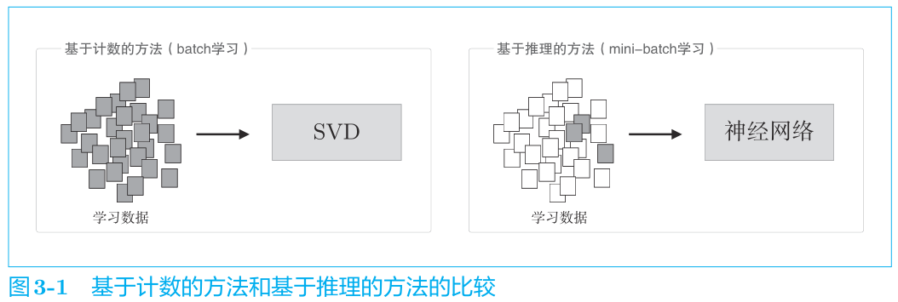

#### 基于推理的方法的概要

当给出周围的
单词（上下文）时，预测“？”处会出现什么单词，这就是推理。

> you
> ? goodbye and i say hello.

解开 ? 并学习规律，就是基于推理的方法的主要任务。通过反复求解这些推理问题，可以学习到单词的出现模式。

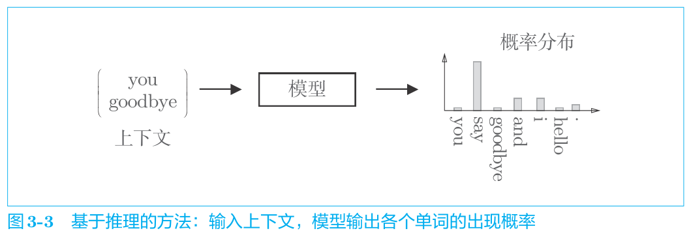

> 如何对基于分布式假设的“单词共现”建模是最重要的研究主题。

#### 神经网络中单词的处理方法

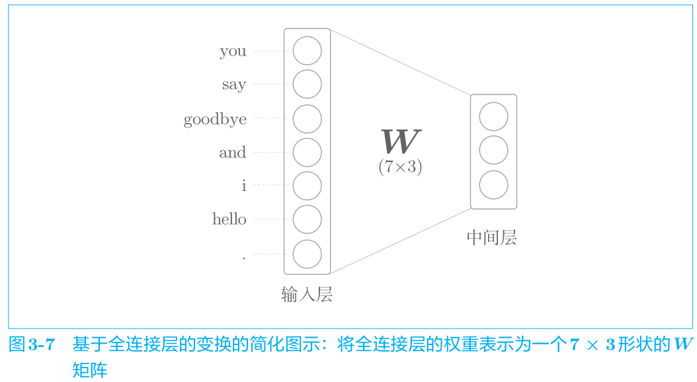

```python
import numpy as np
c = np.array([[1, 0, 0, 0, 0, 0, 0]]) # 输入
W = np.random.randn(7, 3) # 权重
h = np.dot(c, W) # 中间节点
print(h)
# [[-0.70012195 0.25204755 -0.79774592]]
```

这段代码将单词 ID 为 0 的单词表示为了 one-hot 表示，并用全连接层
对其进行了变换。

述代码中的 c 和 W 的矩阵乘积相当于“提取”权重的对应行向量。

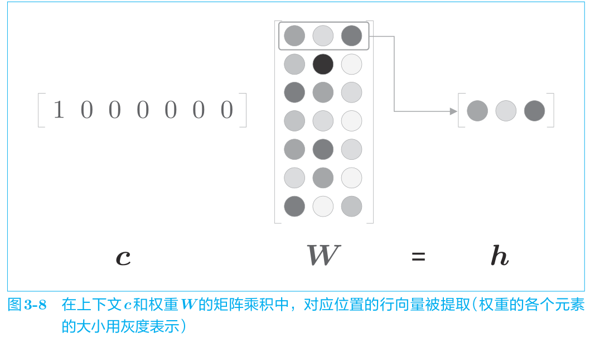

```python
import sys
sys.path.append('..')
import numpy as np
from common.layers import MatMul
c = np.array([[1, 0, 0, 0, 0, 0, 0]])
W = np.random.randn(7, 3)
layer = MatMul(W)
h = layer.forward(c)
print(h)
# [[-0.70012195 0.25204755 -0.79774592]]
```

这里，仅为了提取权重的行向量而进行矩阵乘积计算不是很高效，后续将在 4.1 节进行改进。

### 简单的word2vec

原版 word2vec 提出名为 continuous bag-of-words（CBOW）的
模型作为神经网络。

> CBOW 模型
> 和 skip-gram 模型是 word2vec 中使用的两个神经网络。本节将主要讨论 CBOW 模型

#### CBOW模型的推理

图 3-9 是 CBOW 模型的网络。它有两个输入层，经过中间层到达输出
层。这里，从输入层到中间层的变换由相同的全连接层（权重为 Win）完成，
从中间层到输出层神经元的变换由另一个全连接层（权重为 Wout）完成。

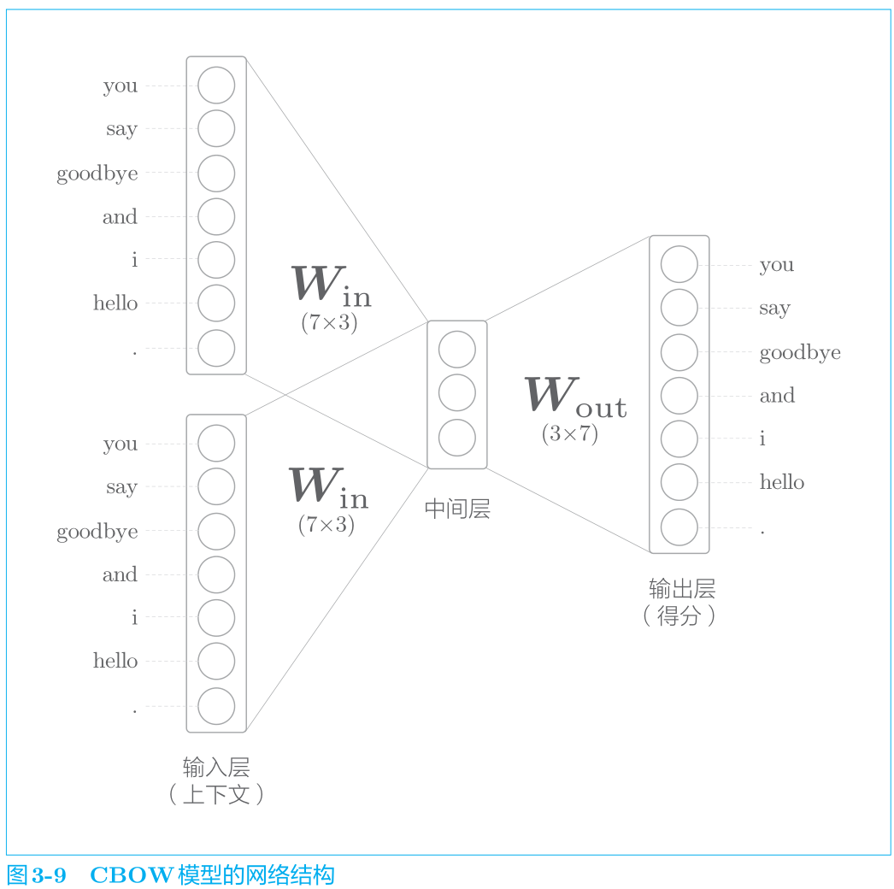

此时，中间层的神经元是各个输
入层经全连接层变换后得到的值的“平均”。

就上面的例子而言，经全连接
层变换后，第 1 个输入层转化为 h1，第 2 个输入层转化为 h2，那么中间层
的神经元是 $\frac{1}{2}(h_1 + h_2)$

输出层的神经元是各个单词的得分，它的值越
大，说明对应单词的出现概率就越高。得分是指在被解释为概率之前的值，
对这些得分应用 Softmax 函数，就可以得到概率。

> 单词的分布式表示矩阵

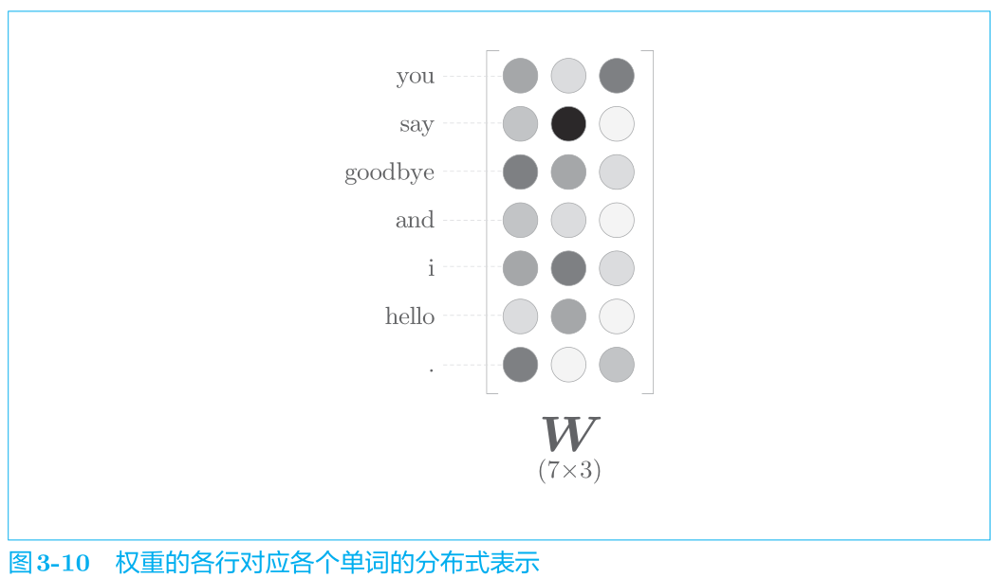

> 中间层的神经元数量比输入层少这一点很重要。中间层需要将预测
> 单词所需的信息压缩保存，从而产生密集的向量表示。这时，中间
> 层被写入了我们人类无法解读的代码，这相当于“编码”工作。

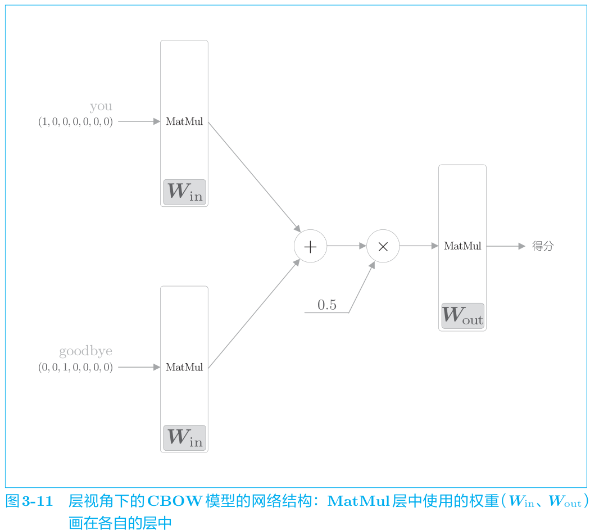

> 不使用偏置的全连接层的处理由 MatMul 层的正向传播代理。这
> 个层在内部计算矩阵乘积。

> 代码位于：src/ch03/cbow_predict.py

#### CBOW模型的学习

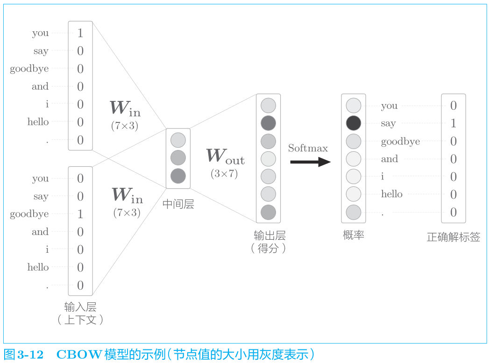

在图 3-12 所示的例子中，上下文是 you 和 goodbye，正确解标签（神
经网络应该预测出的单词）是 say。这时，如果网络具有“良好的权重”，
那么在表示概率的神经元中，对应正确解的神经元的得分应该更高。

**权重 Win 和 Wout 学习到蕴含单词出现模式的向量**。

> CBOW 模型只是学习语料库中单词的出现模式。如果语料库不一样，
> 学习到的单词的分布式表示也不一样。

来考虑一下上述神经网络的学习。我们处
理的模型是一个进行多类别分类的神经网络。因此，对其进行学习只是使用
一下 Softmax 函数和交叉熵误差。首先，使用 Softmax 函数将得分转化为
概率，再求这些概率和监督标签之间的交叉熵误差，并将其作为损失进行学
习。

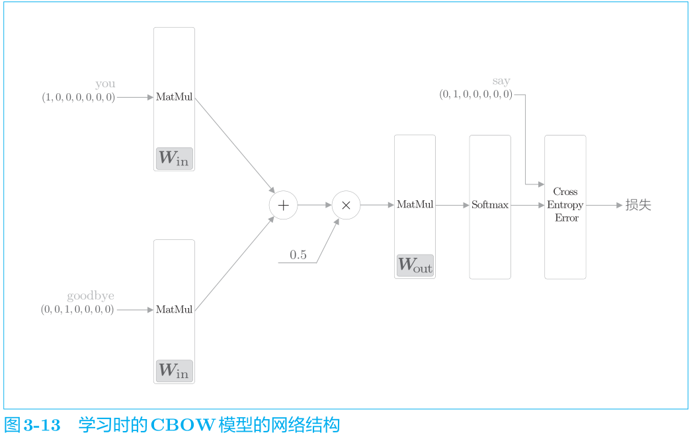

将 softmax 和 cross entropy error 层合并

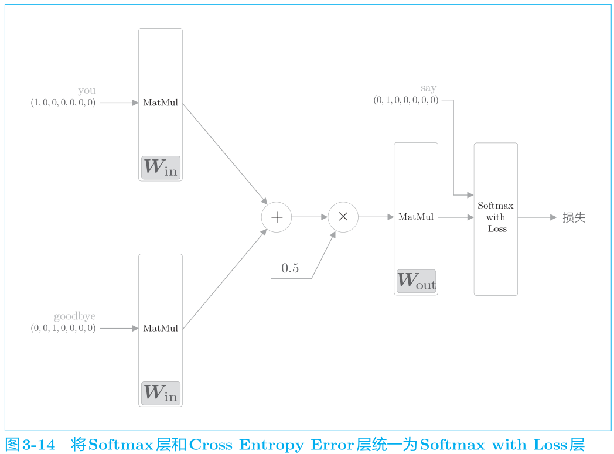

#### word2vec的权重和分布式表示

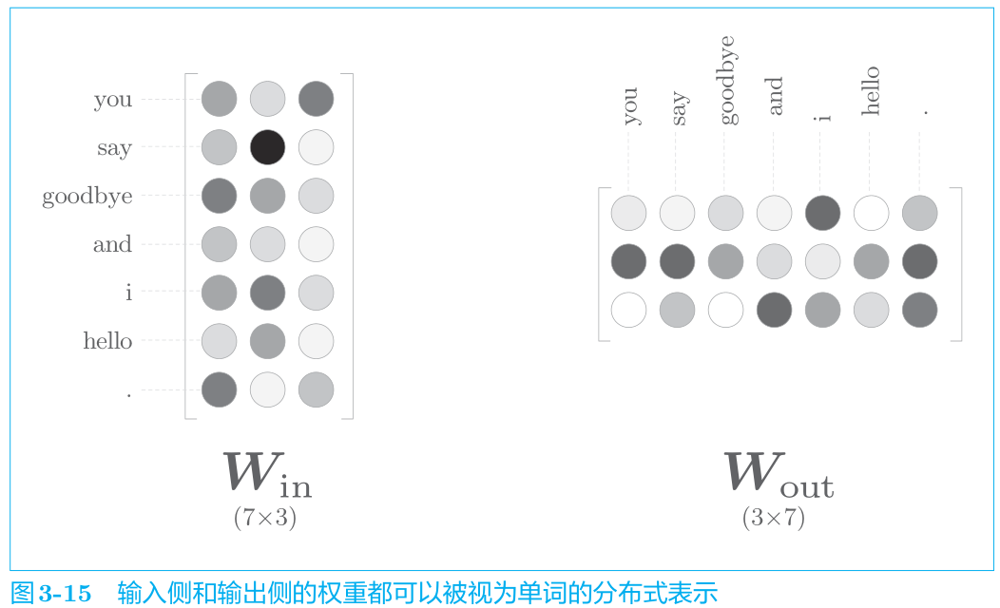

> 问题：我们最终应该使用哪个权重作为单词的分布式表示呢？

- A. 只使用输入侧的权重
- B. 只使用输出侧的权重
- C. 同时使用两个权重

> 文献 [38] 通过实验证明了 word2vec 的 skip-gram 模型中 Win 的有
> 效性。另外，在与 word2vec 相似的 GloVe[27] 方法中，通过将两个
> 权重相加，也获得了良好的结果。

这里，我们使用 Win 作为单词的分布式表示。

### 学习数据的准备

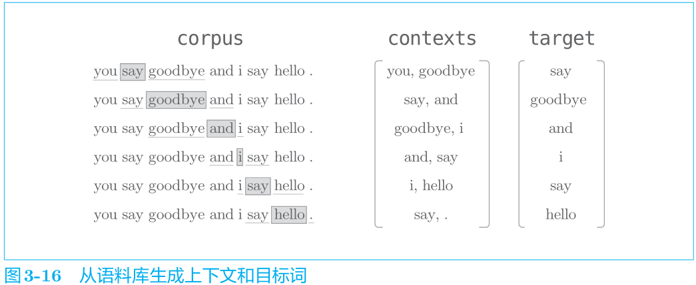

在图 3-16 中，将语料库中的目标单词作为目标词，将其周围的单词作
为上下文提取出来。我们对语料库中的所有单词都执行该操作（两端的单词
除外），可以得到图 3-16 右侧的 contexts（上下文）和 target（目标词）。

contexts 的各行成为神经网络的输入，target 的各行成为正确解标签（要预
测出的单词）。

接下来就是实现：

具体来说，如图
3-17 所示，实现一个当给定 corpus 时返回 contexts 和 target 的函数

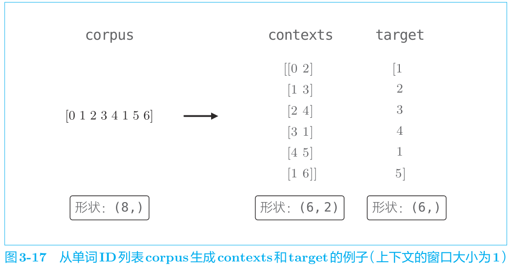

contexts 是 二 维 数 组。 此 时，contexts 的 第 0 维 保
存的是各个上下文数据。

```python
def create_contexts_target(corpus, window_size=1):
    """生成上下文和目标词

    :param corpus: 语料库（单词ID列表）
    :param window_size: 窗口大小（当窗口大小为1时，左右各1个单词为上下文）
    :return:
    """
    #  for example, corpus is [0 1 2 3 4 1 5 6] len=8
    # [1...-1] 去掉头一个，尾一个 [1 2 3 4 1 5]
    # [2...-2] 去掉头2个，尾2个 [2 3 4 1]
    target = corpus[window_size:-window_size]
    contexts = []

    for idx in range(window_size, len(corpus) - window_size):  # (1,7) idx= 1...6 表示中间值得index
        cs = []
        for t in range(-window_size, window_size + 1):  # (-1,2) t= -1...1 表示领域的index
            if t == 0:
                continue
            cs.append(corpus[idx + t])  # idx+t 0...7
        contexts.append(cs)

    return np.array(contexts), np.array(target)
```

#### 转化为one-hot表示

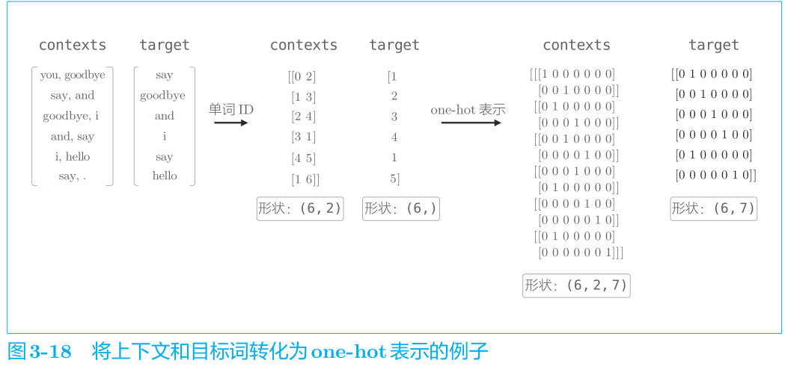

 convert_one_hot() 函数以将单词 ID 转化为 one-hot 表示。

> 这个函数代码在 common/util.py 。

```python
def convert_one_hot(corpus, vocab_size):
    """转换为one-hot表示

    :param corpus: 单词ID列表（一维或二维的NumPy数组）一维用于target，二维用于contexts
    :param vocab_size: 词汇个数
    :return: one-hot表示（二维或三维的NumPy数组）
    """
    N = corpus.shape[0]

    if corpus.ndim == 1:
        one_hot = np.zeros((N, vocab_size), dtype=np.int32)
        for idx, word_id in enumerate(corpus):
            one_hot[idx, word_id] = 1

    elif corpus.ndim == 2:
        C = corpus.shape[1]
        one_hot = np.zeros((N, C, vocab_size), dtype=np.int32)
        for idx_0, word_ids in enumerate(corpus):
            for idx_1, word_id in enumerate(word_ids):
                one_hot[idx_0, idx_1, word_id] = 1

    return one_hot
```

### CBOW模型的实现

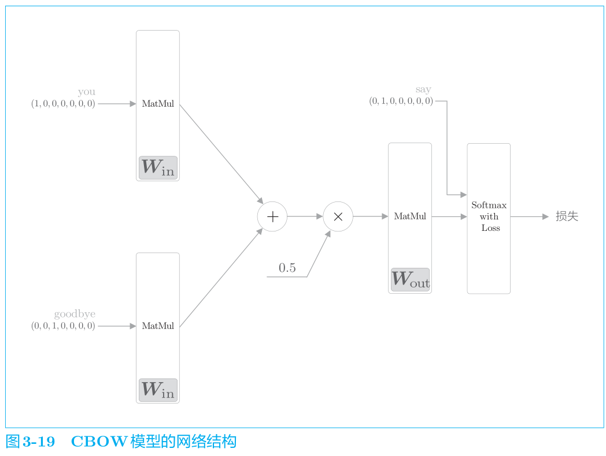

将图 3-19 中的神经网络实现为 SimpleCBOW 类。

> src/ch03/simple_cbow.py

> 这里，多个层共享相同的权重。因此，params列表中存在多个相
> 同的权重。但是，在 params列表中存在多个相同的权重的情况
> 下，Adam、Momentum 等优化器的运行会变得不符合预期（至
> 少就我们的代码而言）。为此，在 Trainer类的内部，在更新参数
> 时会进行简单的去重操作。

**forward() 函数**

```python
def forward(self, contexts, target):
    h0 = self.in_layer0.forward(contexts[:, 0])
    h1 = self.in_layer1.forward(contexts[:, 1])
    h = (h0 + h1) * 0.5
    score = self.out_layer.forward(h)
    loss = self.loss_layer.forward(score, target)
    return loss
```

假定参数 contexts 是一个三维 NumPy 数组，即上一节图
3-18 的例子中 (6,2,7)的形状，其中

- 第 0 维的元素个数是 mini-batch 的数量，
- 第 1 维的元素个数是上下文的窗口大小，
- 第 2 维表示 one-hot 向量。

此外，
target 是 (6,7) 这样的二维形状。

**反向传播 backward()**

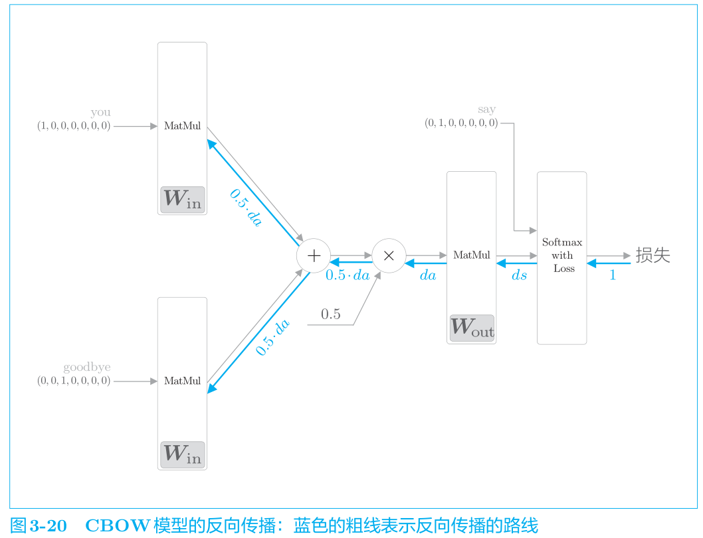

```python
def backward(self, dout=1):
    ds = self.loss_layer.backward(dout)
    da = self.out_layer.backward(ds)
    da *= 0.5
    self.in_layer1.backward(da)
    self.in_layer0.backward(da)
    return None
```

至此，反向传播的实现就结束了。我们已经将各个权重参数的梯度保存在成员变量 grads 中。 因此， 通过先调 用 forward() 函 数， 再 调
用 backward() 函数，grads 列表中的梯度被更新。

**学习的实现**

> ch03/train.py

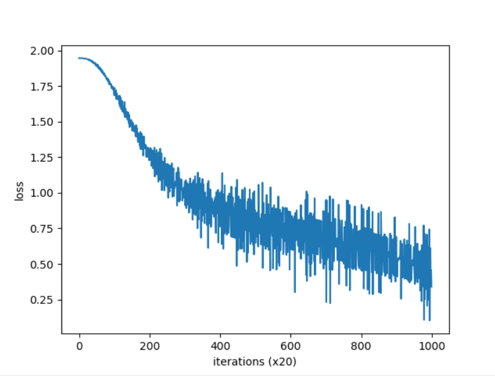

```
you [ 0.9992898   0.93669355  1.7407851   0.9585857  -0.9383475 ]
say [-1.1460844 -1.1411824  1.2721751 -1.0610089  0.896206 ]
goodbye [ 0.97518235  0.9902099  -0.7388944   0.98763245 -0.99433607]
and [-0.6626203  -0.34112453  1.139924   -1.2405113   1.8233453 ]
i [ 0.9713823  0.9919431 -0.7209404  1.0096657 -1.0005871]
hello [ 0.98166966  0.94782895  1.7260851   0.9457392  -0.94521344]
. [-1.3289139  -1.5621759   1.0414828  -0.31470063 -0.7662583 ]
```

这里使用的小型语料库并没有给出很好的结果。当
然，主要原因是语料库太小了。如果换成更大、更实用的语料库，相信会获
得更好的结果。

### word2vec的补充说明

#### CBOW模型和概率

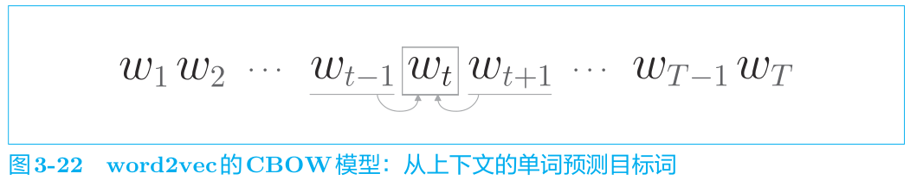

我们用数学式来表示当给定上下文 $w_{t−1}$ 和 $w_{t+1}$时目标词为 $w_t$
的概率。使用后验概率
$$
P\left(w_{t} \mid w_{t-1}, w_{t+1}\right) \tag{3.1}
$$
式 3.1 表示“在 wt−1 和 wt+1 发生后，wt 发生的概率”

结合之前的交叉熵误差
$$
L=-\sum_{k} t_{k} \log y_{k}
$$
其中，yk 表示第 k 个事件发生的概率。tk 是监督标签，
它是 one-hot 向量的元素。这里需要注意的是，“wt 发生”这一事件是正确
解，它对应的 one-hot 向量的元素是 1，其他元素都是 0。

也就是说，当 wt 之外的事件发生时，对应的 one-hot 向量的元素均为 0。

导出公式
$$
L=-\log P\left(w_{t} \mid w_{t-1}, w_{t+1}\right) \tag{3.2}
$$
式 (3.2) 是一
笔样本数据的损失函数。如果将其扩展到整个语料库，则损失函数可以
写为
$$
L=-\frac{1}{T} \sum_{t=1}^{T} \log P\left(w_{t} \mid w_{t-1}, w_{t+1}\right) \tag{3.3}
$$
CBOW 模型学习的任务就是让式 (3.3) 表示的损失函数尽可能地小。
那时的权重参数就是我们想要的单词的分布式表示。

#### skip-gram模型

skip-gram 是反转了 CBOW 模
型处理的上下文和目标词的模型。


 skip-gram 模型则从中间的单词（目标词）预测周围的多个单词.

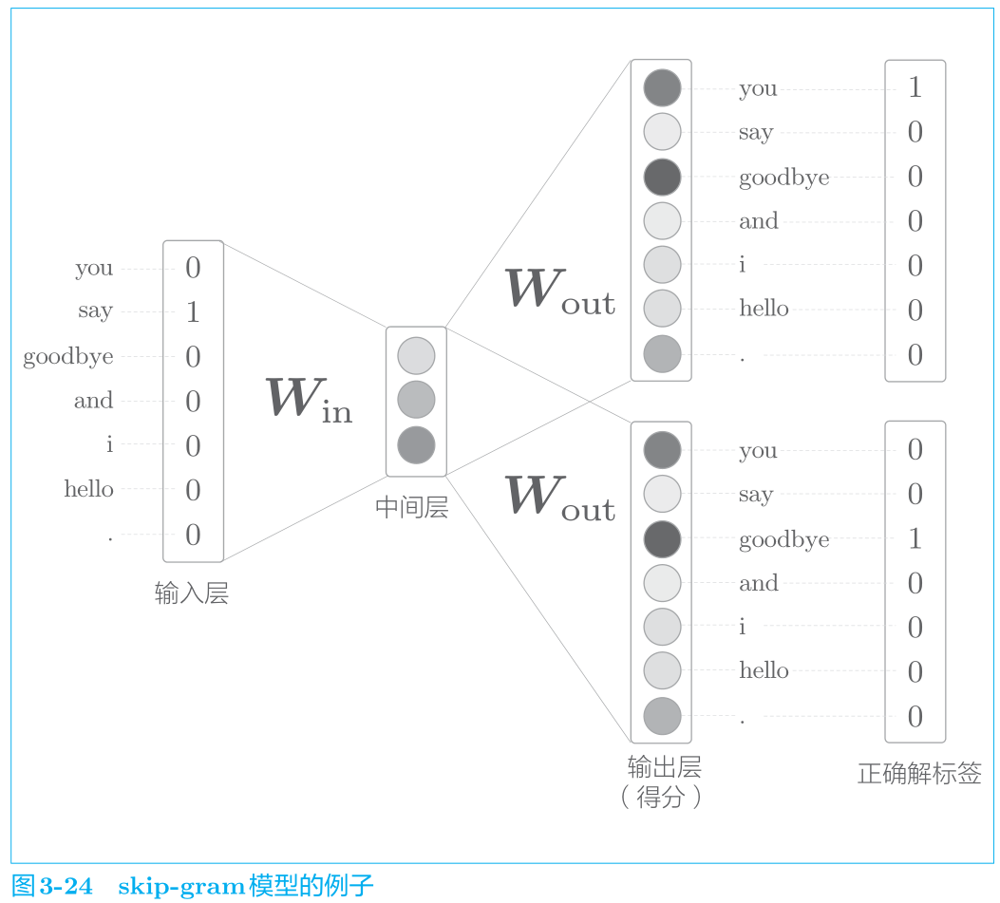

计算损失函数L
$$
\begin{aligned}
L &=-\log P\left(w_{t-1}, w_{t+1} \mid w_{t}\right) \\
&=-\log P\left(w_{t-1} \mid w_{t}\right) P\left(w_{t+1} \mid w_{t}\right) \\
&=-\left(\log P\left(w_{t-1} \mid w_{t}\right)+\log P\left(w_{t+1} \mid w_{t}\right)\right)
\end{aligned}
$$
如果扩展到整个语料库，则
skip-gram 模型的损失函数可以表示为式 (3.7)：
$$
L=-\frac{1}{T} \sum_{t=1}^{T}\left(\log P\left(w_{t-1} \mid w_{t}\right)+\log P\left(w_{t+1} \mid w_{t}\right)\right)
$$
因为 skip-
gram 模型的预测次数和上下文单词数量一样多，所以它的损失函数需要求
各个上下文单词对应的损失的总和。而CBOW模型只需要求目标词的损失。

> 思考：我们应该使用 CBOW 模型和 skip-gram 模型中的哪一个呢？

应该是 skip-gram 模型。从单词的分布式表示的准确度来看，
在大多数情况下，skip-grm 模型的结果更好。特别是随着语料库规模的增
大，在低频词和类推问题的性能方面，skip-gram 模型往往会有更好的表现。

> skip-gram 模型根据一个单词预测其周围的单词，这是一个非常难的问题。经过这个更难的问题的锻炼，skip-gram 模型能提供更好的
> 单词的分布式表示。

代码：ch03/simple_skip_gram.py

#### 基于计数与基于推理

一般情况下，建议使用推理。

### 小结

- 基于推理的方法以预测为目标，同时获得了作为副产物的单词的分布式表示
- word2vec 是基于推理的方法，由简单的 2 层神经网络构成
- word2vec 有 skip-gram 模型和 CBOW 模型
- CBOW 模型从多个单词（上下文）预测 1 个单词（目标词）
- skip-gram 模型反过来从 1 个单词（目标词）预测多个单词（上下文）
- 由于 word2vec 可以进行权重的增量学习，所以能够高效地更新或添
  加单词的分布式表示

