## word2vec的高速化

### word2vec的改进①

简单CBOW模型的问题

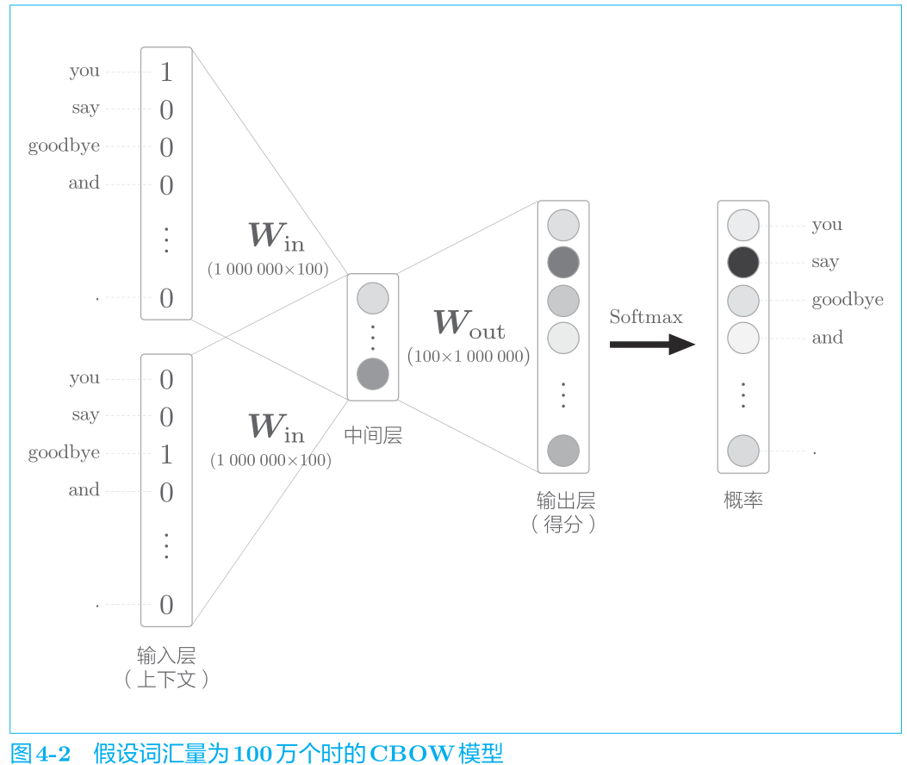

以下两个地方的计算会出现瓶颈。

1. 输入层的 one-hot 表示和权重矩阵 Win 的乘积
2. 中间层和权重矩阵 Wout 的乘积以及 Softmax 层的计算

第一个问题通过引入 Embed 层解决。

第二个问题通过引入 Negative Sampling 损失函数解决。

#### Embedding层的实现

> 关键：根绝idx数组挑选出特定的行。

Embedding 层的正向传播只是从权重矩
阵 W 中提取特定的行，并将该特定行的神经元原样传给下一层。

因此，在反向传播时，从上一层（输出侧的层）传过来的梯度将原样传给下一层（输入侧的层）。不过，从上一层传来的梯度会被应用到权重梯度 dW 的特定行
（idx），如图 4-4 所示。

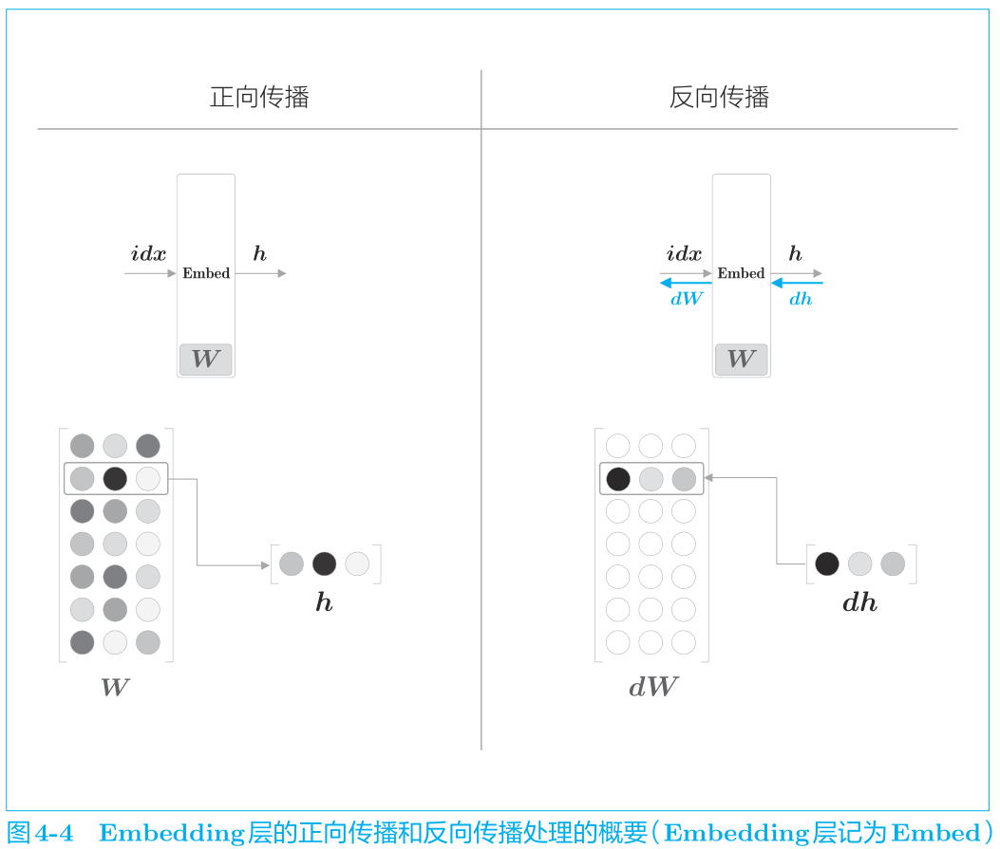

Embed反向传播的实现

```python
    def backward(self, dout):
        dW, = self.grads
        dW[...] = 0
        # dW[self.idx] = dout # 错误的方式，没有考虑idx 重复的情况，需要加法处理

        # 原生实现加法，被下文np替换
        # for i, word_id in enumerate(self.idx):
        #     dW[word_id] += dout[i]

        if GPU:
            np.scatter_add(dW, self.idx, dout)
        else:
            np.add.at(dW, self.idx, dout)
        return None
```

### word2vec的改进②

将采用名为负采样（negative sampling）
的方法作为解决方案。使用 Negative Sampling 替代 Softmax，无论词汇量
有多大，都可以使计算量保持较低或恒定。

> 下面的内容高能预警，需要慢慢啃。

#### 中间层之后的计算问题

- 中间层的神经元和权重矩阵（Wout）的乘积
- Softmax 层的计算

假设中间层向量的大小是 100，权重矩阵的大小是 100 × 1 000 000 ，如此巨大的矩阵乘积计算需要大量时间。

观察 Softmax 的公式
$$
y_{k}=\frac{\exp \left(s_{k}\right)}{\sum_{i=1}^{1000000} \exp \left(s_{i}\right)}\tag{4.1}
$$
式 (4.1) 是第 k 个元素（单词）的 Softmax 的计算式（各个元素的得分
为 s1, s2, · · ·）。因为假定词汇量是 100 万个，所以式 (4.1) 的分母需要进行
100 万次的 exp 计算。

#### 从多分类到二分类

用二分类拟合多分类（multiclass
classification），这是理解负采样的重点。

拿刚才的例子来说，我们把它看作了从 100 万个单词中选择 1 个正确单词的任务。

> 二 分 类 处 理 的 是 答 案 为“Yes/No”的 问 题。

比如，让神经网络来回答“当上下文是 you 和 goodbye 时，目标词是 say 吗？”这个问题，这时输出层只
需要一个神经元即可。可以认为输出层的神经元输出的是 say 的得分。

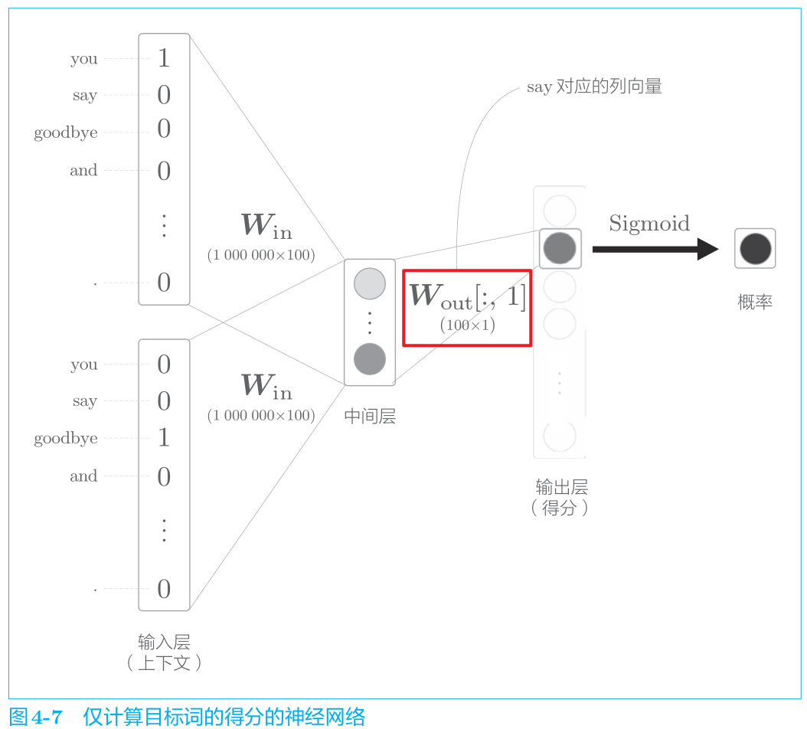

如图 4-7 所示，输出层的神经元仅有一个。因此，要计算中间层和输出
侧的权重矩阵的乘积，只需要提取 say 对应的列（单词向量），并用它与中
间层的神经元计算内积即可。

> Wout[:,1]表示第1列的数据。这里相当于hardcode了列的数值，也就是say这一列。记住这点。否则，看到后面，就很难理解axis=1这种诡异的操作。

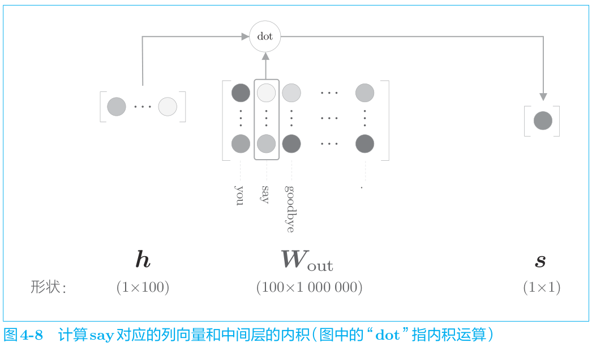

我们提取 say 这个单词向量，再求这个向量和中间层神经元的
内积，这就是最终的得分。

#### sigmoid函数和交叉熵误差

>在多分类的情况下，输出层使用Softmax 函数将得分转化为概率，损
>失函数使用交叉熵误差。
>
>在二分类的情况下，输出层使用sigmoid 函数，
>损失函数也使用交叉熵误差。

回顾sigmoid函数
$$
y=\frac{1}{1+\exp (-x)}
$$
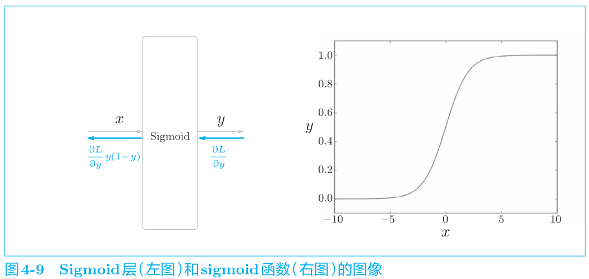

用于 sigmoid 函数的损失函数也是交叉熵误差
$$
L=-(t \log y+(1-t) \log (1-y)) \tag{4.3}
$$
其中，y 是 sigmoid 函数的输出，t 是正确解标签，取值为 0 或 1：取值为 1
时表示正确解是“Yes”；取值为0时表示正确解是“No”。

因此，当t为1时，
输出 −log y；当 t 为 0 时，输出 −log (1 − y)。

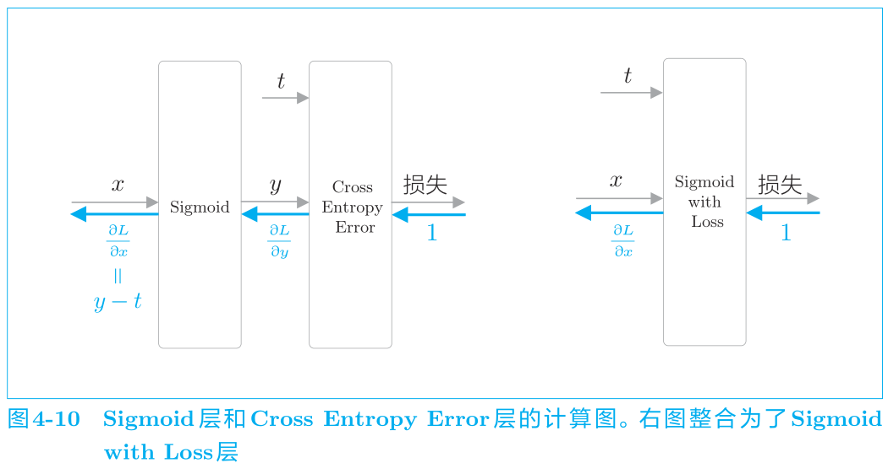

> sigmoid 函数和交叉熵误差的组合产生了 y − t 这样一个漂亮的结果。
> 同样地，Softmax 函数和交叉熵误差的组合，或者恒等函数和均方
> 误差的组合也会在反向传播时传播 y − t。

#### 多分类到二分类的实现

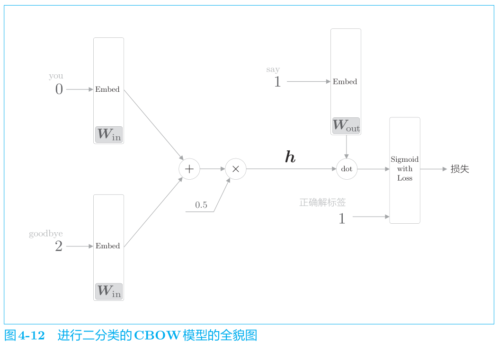

将中间层的神经元记为 h，并计算它与输出侧权重 Wout 中的单
词 say 对应的单词向量的内积。然后，将其输出输入 Sigmoid with Loss 层，
得到最终的损失。

> 向 Sigmoid with Loss 层输入正确解标签 1，这意
> 味着现在正在处理的问题的答案是“Yes”。当答案是“No”时，
> 向 Sigmoid with Loss 层输入 0。

#### 简化层

引入 Embedding Dot 层，该层将图 4-12 中的 Embedding 层和 dot 运算（内积）合并起来处理。

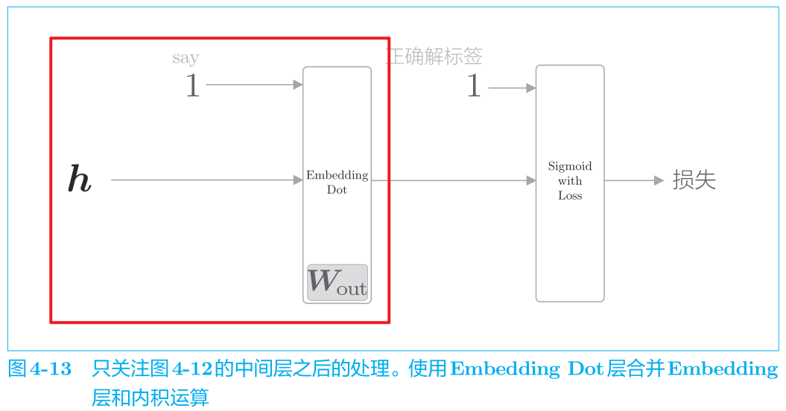

代码实现

```python
class EmbeddingDot:
    def __init__(self, W):
        # embed 保存 Embedding 层
        self.embed = Embedding(W)
        self.params = self.embed.params
        self.grads = self.embed.grads
        # cache 保存正向传播时的计算结果
        self.cache = None

    def forward(self, h, idx):
        target_W = self.embed.forward(idx)
        out = np.sum(target_W * h, axis=1)
        
        self.cache = (h, target_W)
        return out

    def backward(self, dout):
        h, target_W = self.cache
        dout = dout.reshape(dout.shape[0], 1)

        dtarget_W = dout * h # dout * 输入翻转值h
        self.embed.backward(dtarget_W) # 继续往Embed层反向传播
        dh = dout * target_W # dout * 输入翻转值target_w
        return dh
```

关于正向传播的解释

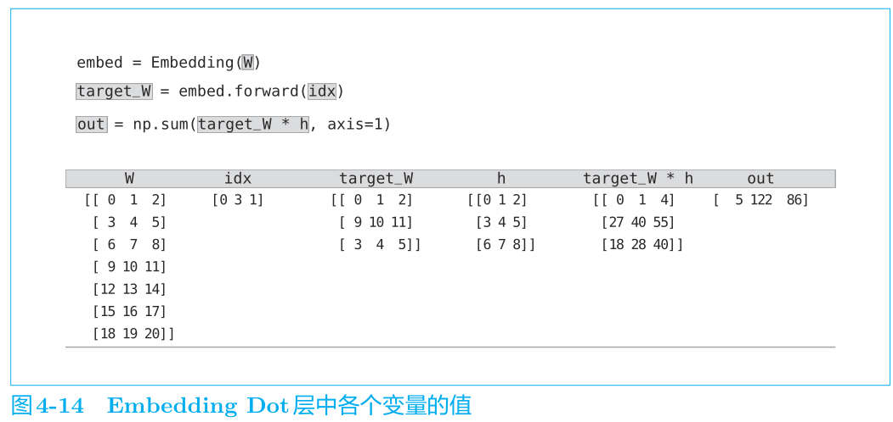

这里，idx 是 [0, 3, 1]，这个例子表示 mini-batch 一并处理 3 笔数据。因为 idx 是 [0, 3, 1]，所以
target_W 将提取出 W 的第 0 行、第 3 行和第 1 行。

另外，**target_W * h 计算对应元素的乘积（NumPy 的“*”计算对应元素的乘积）**。

> 注意不是矩阵乘法。

然后，**对结果逐行（axis=1）进行求和**，得到最终的结果 out。

> 为何需要求和，为何是axis=1？

---

**关于反向传播**

> 难点：偏导的计算以及计算图的绘制。

这行代码如何理解？**为何需要reshape成一列而不是直接使用dout呢？**

```python
dout = dout.reshape(dout.shape[0], 1)
```

#### 负采样

我们目前仅学
习了正例（正确答案），还不确定负例（错误答案）会有怎样的结果。

目标

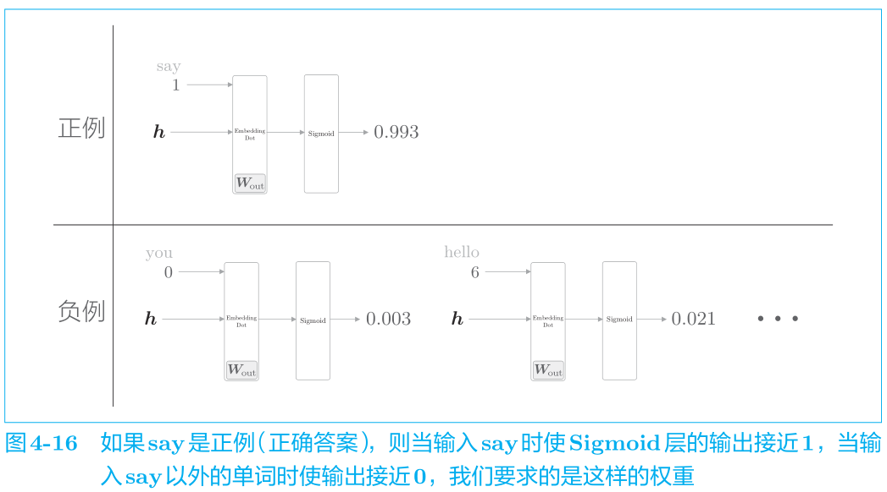

> 为了把多分类问题处理为二分类问题，对于“正确答案”
> （正例）和“错
> 误答案”
> （负例），都需要能够正确地进行分类（二分类）。因此，需要
> 同时考虑正例和负例。

那么，我们需要以所有的负例为对象进行学习吗？答案显然是“No”。
如果以所有的负例为对象，词汇量将暴增至无法处理（更何况本章的目的本
来就是解决词汇量增加的问题）。为此，作为一种近似方法，我们将选择若
干个（5 个或者 10 个）负例。

总而言之，负采样方法既可以求将正例作为目标词时的损失，同时也可
以采样（选出）若干个负例，对这些负例求损失。然后，将这些数据（正例
和采样出来的负例）的损失加起来，将其结果作为最终的损失。

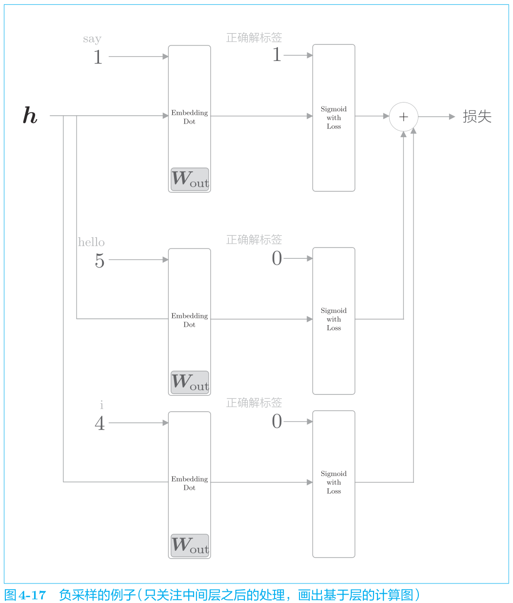

#### 负采样的采样方法

关于这一点，基于语料库的统计数据
进行采样的方法比随机抽样要好。

具体来说，就是让语料库中经常出现的单词容易被抽到，让语料库中不经常出现的单词难以被抽到。

基于语料库中单词使用频率的采样方法会先计算语料库中各个单词的出现次数，并将其表示为“概率分布”，然后使用这个概率分布对单词进行采样。

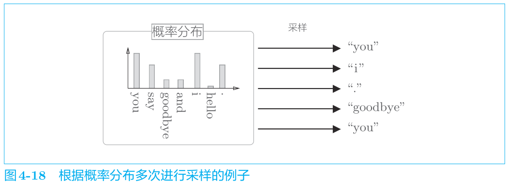

基于语料库中各个单词的出现次数求出概率分布后，只需根据这个概率
分布进行采样就可以了。

> 负采样应当尽可能多地覆盖负例单词，但是考虑到计算的复杂度，
> 有必要将负例限定在较小范围内（5 个或者 10 个）。

word2vec 中提出的负采样
$$
P^{\prime}\left(w_{i}\right)=\frac{P\left(w_{i}\right)^{0.75}}{\sum_{j} P\left(w_{j}\right)^{0.75}}\tag{4.4}
$$
P(wi) 表示第 i 个单词的概率。式 (4.4) 只是对原来的概率分布的各
个元素取 0.75 次方。

> 这是为了防止低频单词被忽略。通过取 0.75 次方，低频单词的概率将稍微变高。

```python
>>> p = [0.7, 0.29, 0.01]
>>> new_p = np.power(p, 0.75)
>>> new_p /= np.sum(new_p)
>>> print(new_p)
[ 0.64196878 0.33150408 0.02652714]
```

> .75 这个值并没有什么理论依据，也可以设置成
> 0.75 以外的值。

实现UnigramSampler 类。参阅 ch04/negative_sampling_layer.py。

> unigram 是“1 个（连 续）单 词”的 意 思。同 样 地，bigram 是“2
> 个 连 续 单 词”的 意 思，trigram 是“3 个 连 续 单 词”的 意 思。这 里
> 使 用 UnigramSampler这 个 名 字，是 因 为 我 们 以 1 个 单 词 为 对 象 创
> 建 概 率 分 布。

在进行初始化时，UnigramSampler 类取 3 个参数，分别是单词 ID 列表
格式的 corpus、对概率分布取的次方值 power（默认值是 0.75）和负例的采
样个数 sample_size。UnigramSampler 类有 get_negative_sample(target) 方法，
该方法以参数 target 指定的单词 ID 为正例，对其他的单词 ID 进行采样。

简单例子

```python
corpus = np.array([0, 1, 2, 3, 4, 1, 2, 3])
power = 0.75
sample_size = 2

sampler = UnigramSampler(corpus, power, sample_size)
target = np.array([1, 3, 0])
negative_sample = sampler.get_negative_sample(target)
print(negative_sample)
# [[0 3]
# [1 2]
# [2 3]]
```

> ch04.negative_sampling_layer.UnigramSampler

#### 负采样的实现

> ch04.negative_sampling_layer.NegativeSamplingLoss.

### 改进版word2vec的学习

#### CBOW模型实现

> src/ch04/cbow.py

#### CBOW模型的学习代码

> src/ch04/train.py

本次的 CBOW 模型的窗口大小为 5，隐藏层的神经元个数为 100。一般而言，当窗口大小为 2 ～ 10、中间
层的神经元个数（单词的分布式表示的维数）为50～500时，结果会比较好。务必使用GPU模式来运行，效率相差太多。

> ch04/cbow_params.pkl中提供了学习好的参数。

#### CBOW模型的评价

> src/ch04/eval.py

结果

```
[query] you
 we: 0.6103515625
 someone: 0.59130859375
 i: 0.55419921875
 something: 0.48974609375
 anyone: 0.47314453125

[query] year
 month: 0.71875
 week: 0.65234375
 spring: 0.62744140625
 summer: 0.6259765625
 decade: 0.603515625

[query] car
 luxury: 0.497314453125
 arabia: 0.47802734375
 auto: 0.47119140625
 disk-drive: 0.450927734375
 travel: 0.4091796875

[query] toyota
 ford: 0.55078125
 instrumentation: 0.509765625
 mazda: 0.49365234375
 bethlehem: 0.47509765625
 nissan: 0.474853515625
```

=> CBOW 模型获得的单词的分布式表示具有良好的性质。

**类推问题**

```
king − man + woman = queen
```

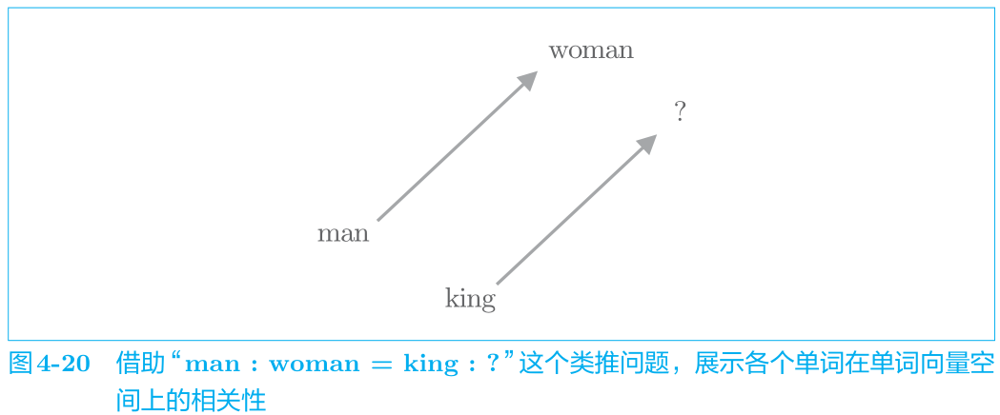

借助向量平行的性质来表示相似度，得出

vec(‘woman’) − vec(‘man’) =
vec(?) − vec(‘king’)

```
[analogy] king:man = queen:?
 woman: 5.16015625
 veto: 4.9296875
 ounce: 4.69140625
 earthquake: 4.6328125
 successor: 4.609375

[analogy] take:took = go:?
 went: 4.55078125
 points: 4.25
 began: 4.09375
 comes: 3.98046875
 oct.: 3.90625

[analogy] car:cars = child:?
 children: 5.21875
 average: 4.7265625
 yield: 4.20703125
 cattle: 4.1875
 priced: 4.1796875

[analogy] good:better = bad:?
 more: 6.6484375
 less: 6.0625
 rather: 5.21875
 slower: 4.734375
 greater: 4.671875
```

对于第 4 题“good :
better = bad : ?”，并没能回答出“worse”。不过，看到 more、less 等比较
级的单词出现在回答中，说明这些性质也被编码在了单词的分布式表示中。

> 这里的类推问题的结果看上去非常好。不过遗憾的是，这是笔者
> 特意选出来的能够被顺利解决的问题。实际上，很多问题都无法
> 获得预期的结果。这是因为 PTB 数据集的规模还是比较小。

### wor2vec相关的其他话题

在自然语言处理领域，单词的分布式表示之所以重要，原因就在于迁移学习（transfer learning）。迁移学习是
指在某个领域学到的知识可以被应用于其他领域。

在解决自然语言处理任务时，一般不会使用 word2vec 从零开始学习单
词的分布式表示，而是**先在大规模语料库（Wikipedia、Google News 等文本数据）上学习，然后将学习好的分布式表示应用于某个单独的任务**。比如，
在文本分类、文本聚类、词性标注和情感分析等自然语言处理任务中，第一步的单词向量化工作就可以使用学习好的单词的分布式表示。在几乎所有类
型的自然语言处理任务中，单词的分布式表示都有很好的效果。

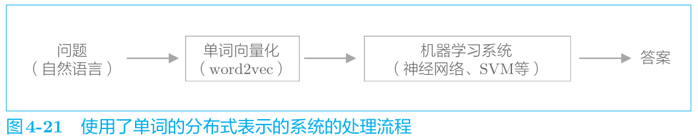

> 比如，单词的分布式表示使用
> Wikipedia 等通用语料库预先学习好，然后机器学习系统（SVM 等）
> 再使用针对当前问题收集到的数据进行学习。但是，如果当前我们
> 面对的问题存在大量的学习数据，则也可以考虑从零开始同时进行
> 单词的分布式表示和机器学习系统的学习。

#### 单词向量的评价方法

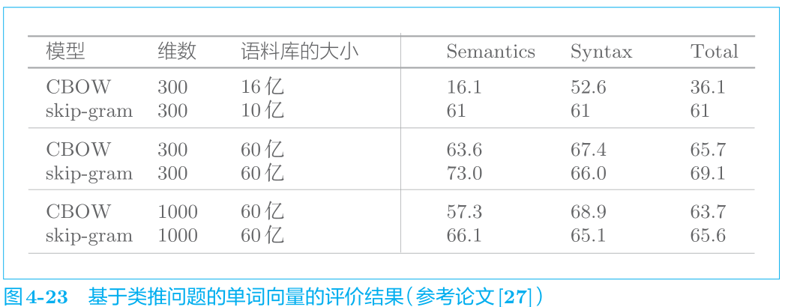

由图 4-23 可知：

- 模型不同，精度不同（根据语料库选择最佳的模型）
- 语料库越大，结果越好（始终需要大数据）
- 单词向量的维数必须适中（太大会导致精度变差）

### 小结

- Embedding 层保存单词的分布式表示，在正向传播时，提取单词 ID
  对应的向量
- 因为 word2vec 的计算量会随着词汇量的增加而成比例地增加，所以最好使用近似计算来加速
- 负采样技术采样若干负例，使用这一方法可以将多分类问题转化为
  二分类问题进行处理
- 基于 word2vec 获得的单词的分布式表示内嵌了单词含义，在相似的
  上下文中使用的单词在单词向量空间上处于相近的位置
- word2vec 的单词的分布式表示的一个特性是可以基于向量的加减法运算来求解类推问题
- word2vec 的迁移学习能力非常重要，它的单词的分布式表示可以应用于各种各样的自然语言处理任务