## RNN

> 前馈网络的问题

前馈（feedforward）是指网络的传播方向是单向的。具体地说，先将输入信号传
给下一层（隐藏层），接收到信号的层也同样传给下一层，然后再传给下一
层……像这样，信号仅在一个方向上传播。

单纯的前馈网络无法充分学习时序数据的性质。

### 概率和语言模型

#### 语言模型

语言模型（language model）给出了单词序列发生的概率。具体来说，
就是使用概率来评估一个单词序列发生的可能性，即在多大程度上是自然的
单词序列。

比如，对于“you say goodbye”这一单词序列，语言模型给出
高概率（比如 0.092）；对于“you say good die”这一单词序列，模型则给
出低概率（比如 0.000 000 000 003 2）。

使用数学式来表示语言模型。这里考虑由 m 个单词 w1, · · · ,
wm 构成的句子，将单词按 w1, · · · , wm 的顺序出现的概率记为 P (w1, · · · ,
wm)。因为这个概率是多个事件一起发生的概率，所以称为联合概率。

使用后验概率可以将这个联合概率 P (w1, · · · , wm) 分解成如下形式
$$
\begin{aligned}
P\left(w_{1}, \cdots, w_{m}\right)=& P\left(w_{m} \mid w_{1}, \cdots, w_{m-1}\right) P\left(w_{m-1} \mid w_{1}, \cdots, w_{m-2}\right) \\
& \cdots P\left(w_{3} \mid w_{1}, w_{2}\right) P\left(w_{2} \mid w_{1}\right) P\left(w_{1}\right) \\
=& \prod_{t=1}^{m} P\left(w_{t} \mid w_{1}, \cdots, w_{t-1}\right)^{(1)}
\end{aligned}\tag{5.4}
$$
与表示总和的
$\sum$ （sigma）相对，式 (5.4) 中的
$\prod $（pi）表示所有元素相乘的乘积。如式 (5.4) 所示，联合概率可以由后验概率的乘积表示。

> 公式5.4的推导过程

首先，有概率乘法定理
$$
P(A, B)=P(A \mid B) P(B)=P(B \mid A) P(A)
$$
得到
$$
P(\underbrace{w_{1}, \cdots, w_{m-1}}_{A}, w_{m})=P\left(A, w_{m}\right)=P\left(w_{m} \mid A\right) P(A)
$$
再对 $A(w_1, · · · , w_{m−1})$ 进行同样的变形
$$
P(A)=P(\underbrace{w_{1}, \cdots, w_{m-2}}_{A^{\prime}}, w_{m-1})=P\left(A^{\prime}, w_{m-1}\right)=P\left(w_{m-1} \mid A^{\prime}\right) P\left(A^{\prime}\right)
$$
这样计算下去，最终就可以得到式5.4。

---

需要注意的是，这个后验概率是以目标词左侧
的全部单词为上下文（条件）时的概率。

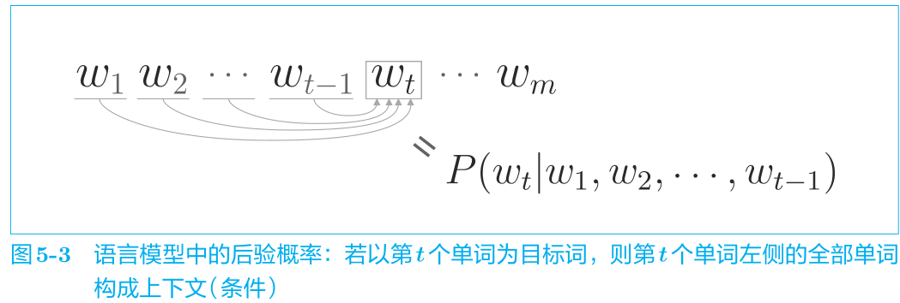

目标就是求 $P (w_t|w_1, · · · , w_{t−1})$ 这个概率，从而求得语言模型的联合概率 $P (w_1, · · · , w_m)$。

#### 将CBOW模型用作语言模型？

如果要把 word2vec 的 CBOW 模型（强行）用作语言模型，该
怎么办呢？可以通过将上下文的大小限制在某个值来近似实现，用数学式可
以如下表示：
$$
P\left(w_{1}, \cdots, w_{m}\right)=\prod_{t=1}^{m} P\left(w_{t} \mid w_{1}, \cdots, w_{t-1}\right) \approx \prod_{t=1}^{m} P\left(w_{t} \mid w_{t-2}, w_{t-1}\right)
$$
将上下文限定为左侧的 2 个单词，就可以用 CBOW
模型（CBOW 模型的后验概率）近似表示。

> 当某个事件的概率仅取决于其前面的 N 个
> 事件时，称为“N 阶马尔可夫链”。这里展示的是下一个单词仅取决
> 于前面 2 个单词的模型，因此可以称为“2 阶马尔可夫链”。

> CBOW 是 Continuous Bag-Of-Words 的 简 称。Bag-Of-Words 是
> “一袋子单词”的意思，这意味着袋子中单词的顺序被忽视了。

问题来了，**我们想要保留单词的顺序信息**。

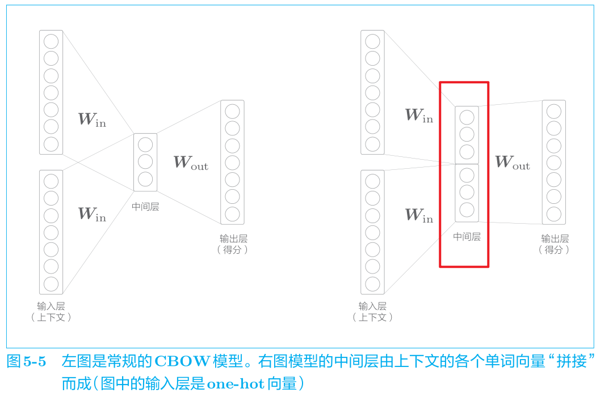

如图 5-5 的左图所示，在 CBOW 模型的中间层求单词向量的和，因此
上下文的单词顺序会被忽视。比如，(you, say) 和 (say, you) 会被作为相同
的内容进行处理。

右图，在中间层“拼接”（concatenate）上下文的单词向量。实际上，
“Neural Probabilistic Language Model”[28] 中提出的模型就采用了这个方法
（关于模型的详细信息，参考论文 [28]）。但是，如果采用拼接的方法，权重
参数的数量将与上下文大小成比例地增加。这会导致计算量过大的问题。

> 怎么办呢？

RNN 具有一个机制，无论上下文有多长，都能将上下文信息记住。因此，使用 RNN 可以处理任意长度的时序数据。

> word2vec 是以获取单词的分布式表示为目的的方法，一般不会用于语言模型。

#### RNN

RNN（Recurrent Neural Network）。

#### 循环的神经网络

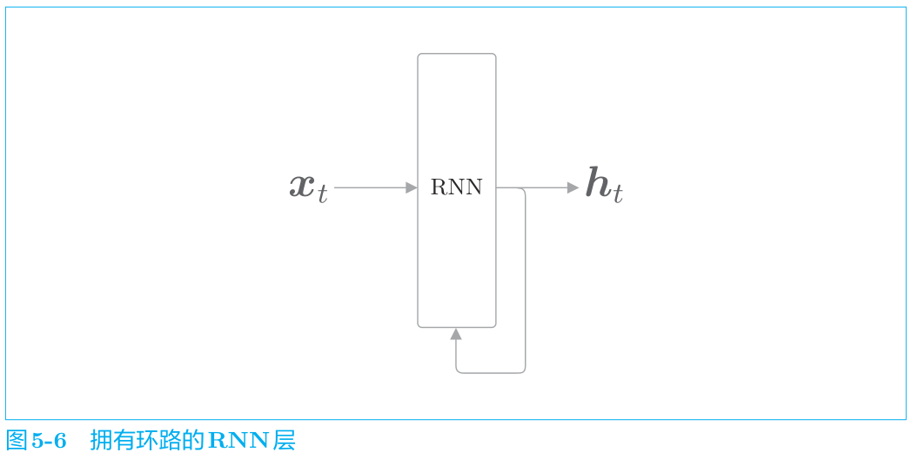

如图 5-6 所示，RNN 层有环路。通过该环路，数据可以在层内循环。
在图 5-6 中，时刻 t 的输入是 xt，这暗示着时序数据 (x0, x1, · · · , xt, · · ·) 会
被输入到层中。然后，以与输入对应的形式，输出 (h0, h1, · · · , ht, · · ·)。

这里假定在各时刻向 RNN 层输入的 xt 是向量。比如，在处理句子（单
词序列）的情况下，将各个单词的分布式表示（单词向量）作为 xt 输入
RNN 层。

> 可以发现输出有两个分叉，意味着同一个东西被复制了。输出中的一个分叉将成为其自身的输入。

从现在开始，为了节省纸面空间，将假设数据是从下向上流动的（这是为了在之后需要展开循环时，能够在左右方向上将层铺开）。

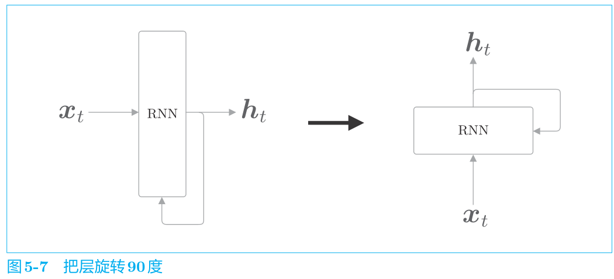

#### 展开循环

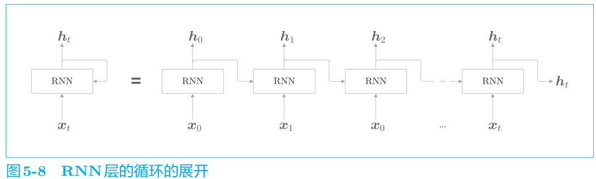

> 勘误：这个图中间的x0应该是x2。

通过展开 RNN 层的循环，我们将其转化为了从左向右
延伸的长神经网络。这和我们之前看到的前馈神经网络的结构相同（前馈网
络的数据只向一个方向传播）。不过，图 5-8 中的多个 RNN 层都是“同一
个层”，这一点与之前的神经网络是不一样的。
$$
\boldsymbol{h}_{t}=\tanh \left(\boldsymbol{h}_{t-1} \boldsymbol{W}_{h}+\boldsymbol{x}_{t} \boldsymbol{W}_{x}+\boldsymbol{b}\right)
\tag{5.9}
$$
说明一下式 (5.9) 中的符号。RNN 有两个权重，分别是将输入 x
转化为输出 h 的权重 $W_x$ 和将前一个 RNN 层的输出转化为当前时刻的输出的权重 $W_h$。此外，还有偏置 b。这里，$h_{t−1}$ 和 $x_t$ 都是行向量。

在式 (5.9) 中，首先执行矩阵的乘积计算，然后使用 tanh 函数（双曲正切函数）变换它们的和，其结果就是时刻 t 的输出 ht。这个 ht 一方面向上输出到另一个层，另一方面向右输出到下一个 RNN 层（自身)。

可以看出，输出 ht 是由前一个输出 ht−1 计算得出。从另一个角度看，这可以解释为，RNN 具有“状态”h。

#### Backpropagation Through Time

将 RNN 层展开后，就可以视为在水平方向上延伸的神经网络，因此
RNN 的学习可以用与普通神经网络的学习相同的方式进行。

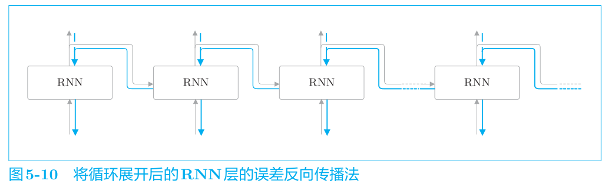

这里的误差反向传播法是“按时间顺序展开的神经网络的误差反向传播法”，所以称为 Backpropagation Through Time（基于时间的反
向传播），简称 BPTT。

随着时序数据的时间跨度的增大，BPTT 消耗的计算机资源也会成比例地增大。另外，反向传播
的梯度也会变得不稳定。

#### Truncated BPTT

在处理长时序数据时，通常的做法是将网络连接截成适当的长度。就是将时间轴方向上过长的网络在合适的位置进行截断，从而创建多个小型网络，然后对截出来的小型网络执行误差反向传播法，这个方法称
为 Truncated BPTT（截断的 BPTT）。

**在 Truncated BPTT 中，网络连接被截断，但严格地讲，只是网络的**
**反向传播的连接被截断，正向传播的连接依然被维持**。

> 为什么需要截断？

在处理长度为 1000 的时序数据时，如果展开 RNN 层，它将成为在水
平方向上排列有 1000 个层的网络。当然，无论排列多少层，都可以根据误
差反向传播法计算梯度。但是，如果序列太长，

- 会出现计算量或者内存使用量方面的问题。
- 此外，随着层变长，梯度逐渐变小，梯度将无法向前一层传递。

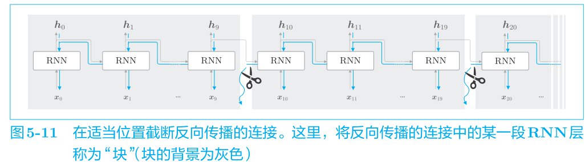

在进行 RNN 的学习时，必须考虑到正向传播之间是有关
联的，这意味着必须按顺序输入数据。

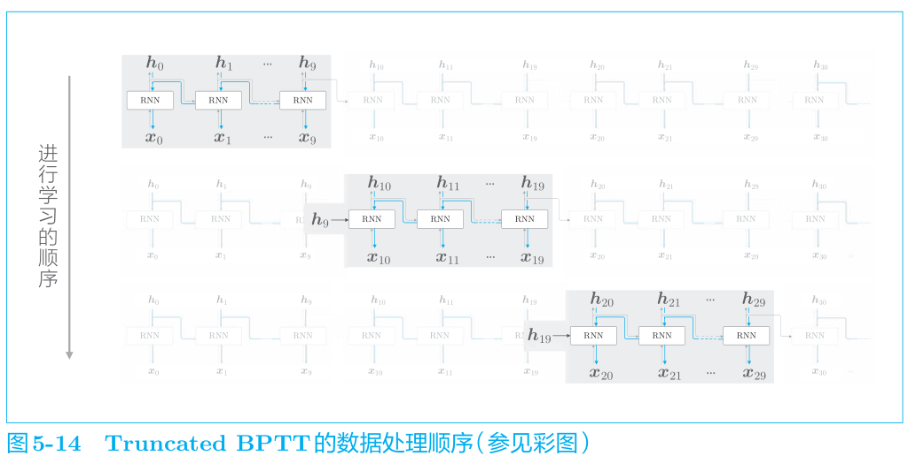

重点: 正向传播的计算需要前一个块最后的隐藏状态 h9，h19，...。

#### Truncated BPTT的mini-batch学习

> 对长度为1000的时序数据，以时间长度10为单位进行截断。此时，
> 如何将批大小设为 2 进行学习呢？

在这种情况下，作为 RNN 层的输入数据，
第 1 笔样本数据从头开始按顺序输入，第 2 笔数据从第 500 个数据开始按顺
序输入。也就是说，将开始位置平移 500，如图 5-15 所示

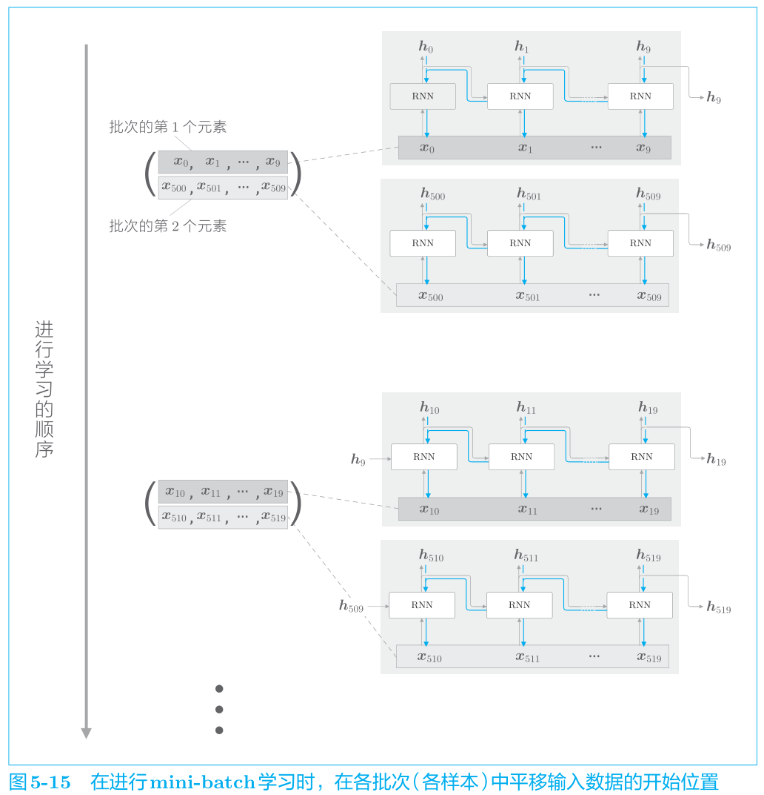

如图 5-15 所示，批次的第 1 个元素是 x0, · · · , x9，批次的第 2 个元素
是 x500, · · · , x509，将这个 mini-batch 作为 RNN 的输入数据进行学习。因
为要输入的数据是按顺序的，所以接下来是时序数据的第 10 ~ 19 个数据和
第 510 ~ 519 个数据。像这样，在进行 mini-batch 学习时，平移各批次输入
数据的开始位置，按顺序输入。

> 此外，如果在按顺序输入数据的过程中遇到了结尾，则需要设法返回头部。?

### RNN 实现

考虑到基于 Truncated
BPTT 的学习，只需要创建一个在水平方向上长度固定的网络序列。这个固定的长度就是截断的大小。

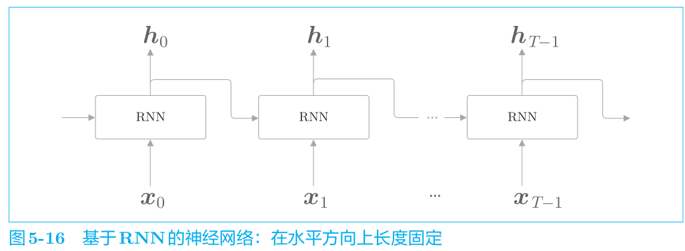

目标神经网络接收长度为 T 的时序数据（T 为任意值），
输出各个时刻的隐藏状态 T 个。这里，考虑到模块化，将图 5-16 中在水平
方向上延伸的神经网络实现为“一个层”。

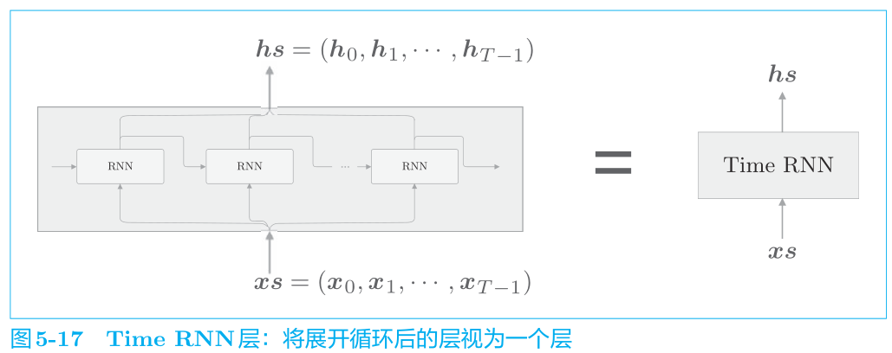

将 (x0, x1, · · · , xT−1) 捆绑为
xs 作为输入，将 (h0, h1, · · · , hT−1) 捆绑为 hs 作为输出。

> 像 Time RNN 这样，将整体处理时序数据的层以单词“Time”开头命名。

首先，实现进行 RNN 单步处理的 RNN
类；然后，利用这个 RNN 类，完成一次进行 T 步处理的 TimeRNN 类。

#### RNN层的实现

回顾RNN
正向传播的数学式
$$
\boldsymbol{h}_{t}=\tanh \left(\boldsymbol{h}_{t-1} \boldsymbol{W}_{h}+\boldsymbol{x}_{t} \boldsymbol{W}_{x}+\boldsymbol{b}\right)
$$
将数据整理为 mini-batch 进行处理。因此，xt（和 ht）在行方向上保存各样本数据。

假设批大小是 N，输入向量的维数是 D，隐藏状态向量的维数是 H。

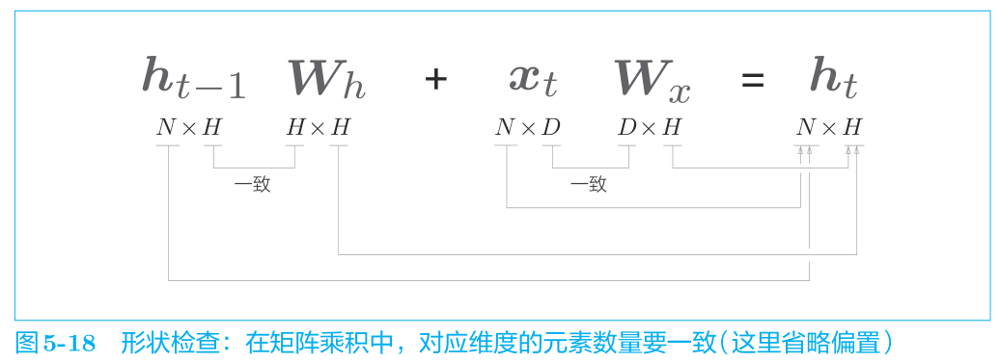

RNN 类的初始化方法和正向传播的 forward() 方法（ common/time_layers.py）。

```python
class RNN:
    def __init__(self, Wx, Wh, b):
        self.params = [Wx, Wh, b]
        self.grads = [np.zeros_like(Wx), np.zeros_like(Wh), np.zeros_like(b)]
        self.cache = None

    def forward(self, x, h_prev):
        Wx, Wh, b = self.params
        t = np.dot(h_prev, Wh) + np.dot(x, Wx) + b
        h_next = np.tanh(t)

        self.cache = (x, h_prev, h_next)
        return h_next
```

实现非常易于理解，对应公式。

这里从前一个 RNN 层接收的输入是 h_prev，当前时刻的 RNN 层的输出（= 下
一时刻的 RNN 层的输入）是 h_next。

---

实现 RNN 的反向传播。通过图 5-19
的计算图再次确认一下 RNN 的正向传播。

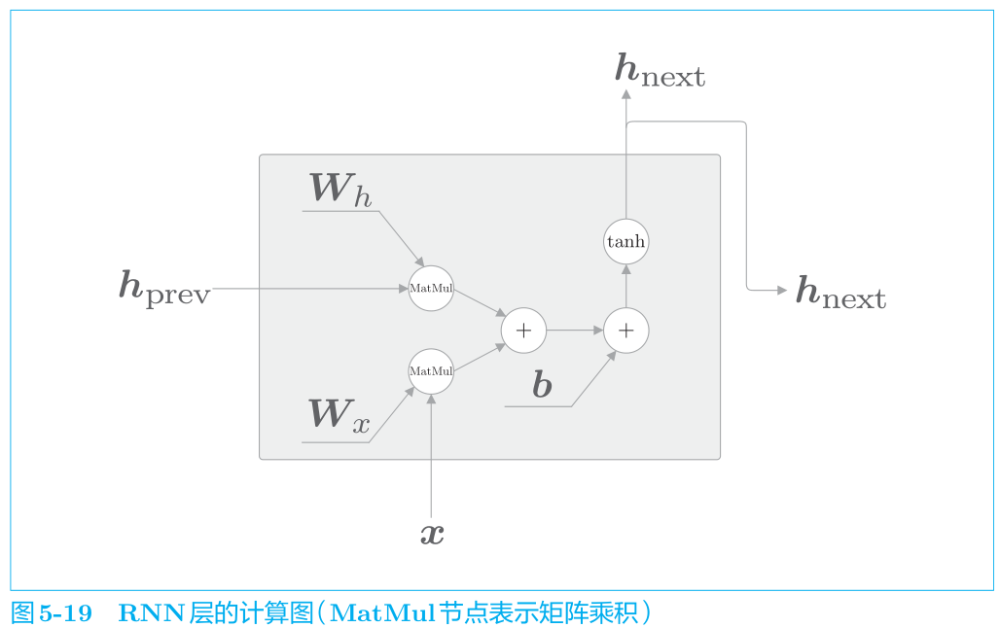

> 因为偏置
> b 的加法运算会触发广播操作，所以严格地讲，这里还应该加上 Repeat 节
> 点。不过简单起见，这里省略了它（具体请参考 1.3.4.3 节）。

反向传播计算图

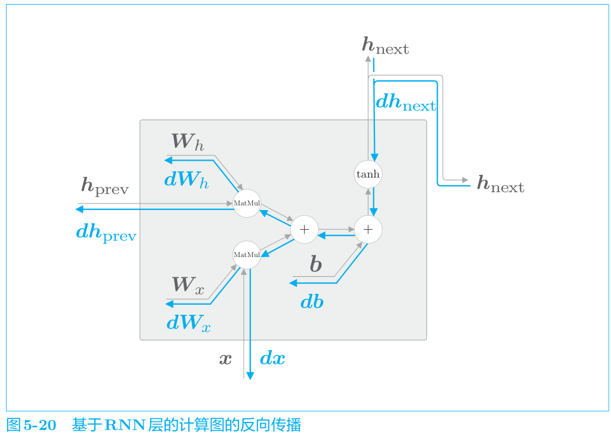

```python
def backward(self, dh_next):
    Wx, Wh, b = self.params
    x, h_prev, h_next = self.cache

    dt = dh_next * (1 - h_next ** 2)
    db = np.sum(dt, axis=0)
    
    dWh = np.dot(h_prev.T, dt)
    dh_prev = np.dot(dt, Wh.T)
    dWx = np.dot(x.T, dt)
    dx = np.dot(dt, Wx.T)

    self.grads[0][...] = dWx
    self.grads[1][...] = dWh
    self.grads[2][...] = db

    return dx, dh_prev
```

 先看下y=tanh(x)这个函数的导数
$$
\frac{\mathrm{d}}{\mathrm{d} x} \tanh x=1-\tanh ^{2} x=\operatorname{sech}^{2} x=\frac{1}{\cosh ^{2} x}
$$

> https://zh.wikipedia.org/wiki/%E5%8F%8C%E6%9B%B2%E5%87%BD%E6%95%B0

也就是 y' = 1-y^2 = 1 - h_next ** 2。于是有了这行

```python
dt = dh_next * (1 - h_next ** 2)
```

db = np.sum(dt, axis=0) 这行求和为何需要按行方向求和？

> 因为mini-batch的原因，最终得出N x 1形状就是db。

下面的这四行

```python
dWh = np.dot(h_prev.T, dt)
dh_prev = np.dot(dt, Wh.T)
dWx = np.dot(x.T, dt)
dx = np.dot(dt, Wx.T)
```

可以根据矩阵形状一致性来反推。

这三行

```
    self.grads[0][...] = dWx
    self.grads[1][...] = dWh
    self.grads[2][...] = db
```

根据之前的

```
self.grads = [np.zeros_like(Wx), np.zeros_like(Wh), np.zeros_like(b)]
```

来对应保存。

#### Time RNN层的实现

Time RNN 层由 T 个 RNN 层构成（T 可以设置为任意值）。

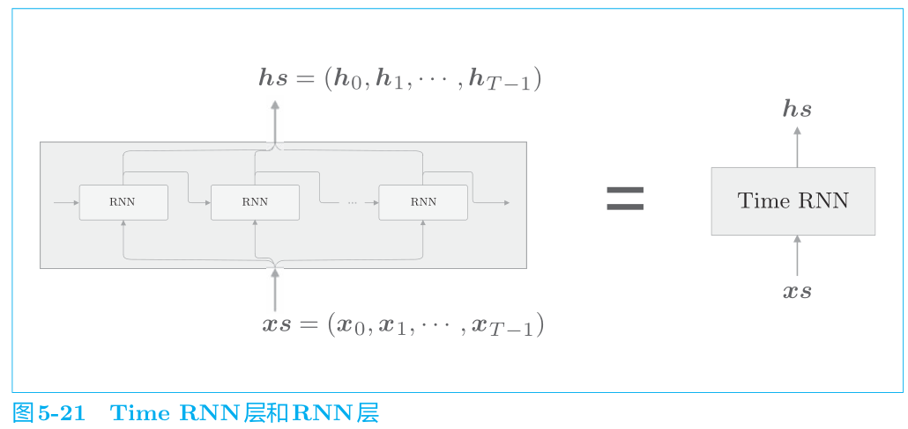

这里，RNN 层的隐藏状态 h 保存在成
员变量中。如图 5-22 所示，在进行隐藏状态的“继承”时会用到它。

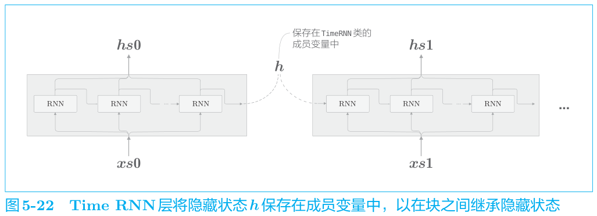

如图 5-22 所示，使用 Time RNN 层管理 RNN 层的隐藏状态。使用 Time RNN 的人就不必考虑 RNN 层的隐藏状态的“继承工作”了。另外，用 stateful 这个参数来控制是否继承隐藏状态。

- 有状态：维持 Time RNN 层的隐藏状态。无论时序数据多长，Time RNN
  层的正向传播可以不中断进行。
- 无状态：当 stateful 为 False 时，每次调用Time RNN 层的 forward() 时，第一个 RNN 层的隐藏状态都会被初始化为零矩阵（所有元素均为 0 的矩阵）。

> forward实现分析

```python
def forward(self, xs):
    Wx, Wh, b = self.params
    N, T, D = xs.shape
    D, H = Wx.shape

    self.layers = []
    hs = np.empty((N, T, H), dtype='f')

    if not self.stateful or self.h is None:
    	self.h = np.zeros((N, H), dtype='f')

	for t in range(T):
        layer = RNN(*self.params)
        self.h = layer.forward(xs[:, t, :], self.h)
        hs[:, t, :] = self.h
        self.layers.append(layer)

	return hs
```

正向传播的 forward(xs) 方法从下方获取输入 xs，xs 囊括了 T 个时序数
据。因此，如果批大小是 N，输入向量的维数是 D，则 xs 的形状为 (N,T,D)。

在首次调用时（self.h 为 None 时），RNN 层的隐藏状态 h 由所有元素
均为 0 的矩阵初始化。另外，在成员变量 stateful 为 False 的情况下，h 将
总是被重置为零矩阵。

在主体实现中，首先通过 hs=np.empty((N, T, H), dtype='f') 为输出准
备一个“容器”。接着，在 T 次 for 循环中，生成 RNN 层，并将其添加到成员变量 layers 中。然后，计算 RNN 层各个时刻的隐藏状态，并存放在 hs
的对应索引（时刻）中。

> 如果调用 Time RNN 层的 forward()方法，则成员变量 h中将存放
> 最后一个 RNN 层的隐藏状态。

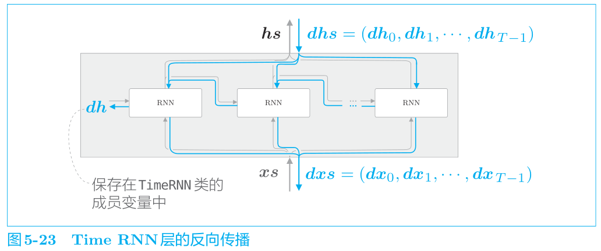

将从上游（输出侧的层）传来的梯度记为 dhs，将流向
下游的梯度记为 dxs。因为这里我们进行的是 Truncated BPTT，所以不需要流向这个块上一时刻的反向传播。不过，我们将流向上一时刻的隐藏状态
的梯度存放在成员变量 dh 中。这是因为在第 7 章探讨 seq2seq（sequence-
to-sequence，序列到序列）时会用到它。

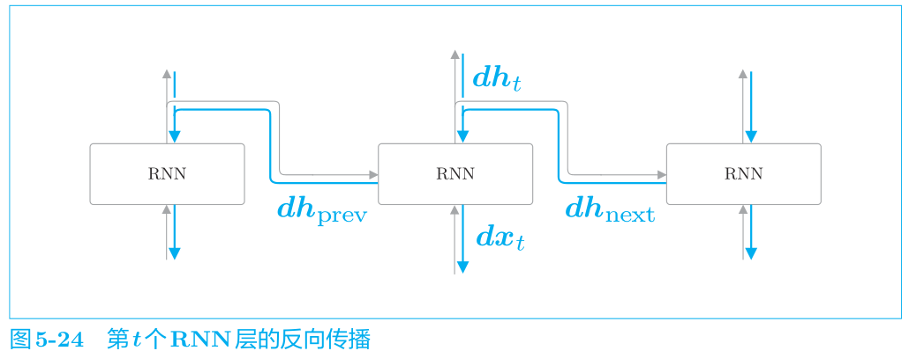

从上方传来的梯度 dht 和从将来的层传来的梯度 dhnext 会传到第 t 个
RNN 层。这里需要注意的是，RNN 层的正向传播的输出有两个分叉。在正
向传播存在分叉的情况下，在反向传播时各梯度将被求和。因此，在反向传
播时，流向 RNN 层的是求和后的梯度。

> 从上方传来的梯度 dht 和从将来的层传来的梯度 dhnext 会传到第 t 个
> RNN 层。
>
> 注意这里的从将来的层传来的梯度 dhnext 。

RNN 层的正向传播的输出有两个分叉。在正
向传播存在分叉的情况下，在反向传播时各梯度将被求和。因此，在反向传
播时，流向 RNN 层的是求和后的梯度。

> backward实现

```python
def backward(self, dhs):
    Wx, Wh, b = self.params
    N, T, H = dhs.shape
    D, H = Wx.shape

    # 创建传给下游的梯度的“容器”（dxs）
    dxs = np.empty((N, T, D), dtype='f')
    dh = 0
    grads = [0, 0, 0]
    # 按与正向传播相反的方向
    for t in reversed(range(T)):
        layer = self.layers[t]
        # 调用 RNN 层的 backward() 方法
        # 注意，这里的dh被不断反向传递并更新
        dx, dh = layer.backward(dhs[:, t, :] + dh)
        # 取得各个时刻的梯度 dx，并存放在 dxs 的对应索引处
        dxs[:, t, :] = dx

        # 关于权重参数，需要求各个 RNN 层的权重梯度的和
        for i, grad in enumerate(layer.grads):
            grads[i] += grad

    # 通过“...”用最终结果覆盖成员变量 self.grads
    for i, grad in enumerate(grads):
        self.grads[i][...] = grad
    self.dh = dh

    return dxs
```

> 在 Time RNN 层中有多个 RNN 层。另外，这些 RNN 层使用相
> 同的权重。因此，Time RNN 层的（最终）权重梯度是各个 RNN
> 层的权重梯度之和。

### 处理时序数据的层的实现

本节将创建几个可以处理时序数据的新层。将基于 RNN 的语言模型称为 RNNLM（RNN
Language Model，RNN 语言模型）。

#### RNNLM的全貌图

左图显示了 RNNLM 的层结构，右图显示了在时间
轴上展开后的网络。

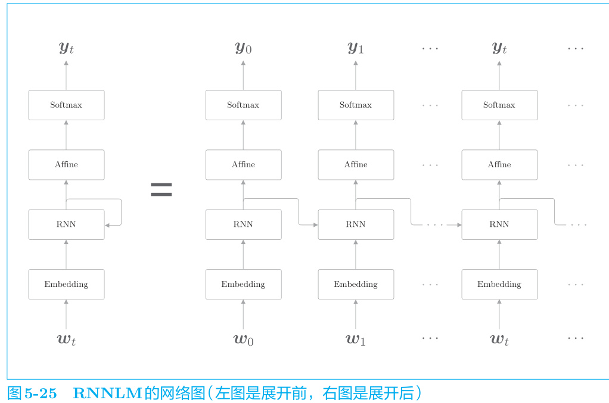

图 5-25 中的第 1 层是 Embedding 层，该层将单词 ID 转化为单词的分
布式表示（单词向量）。然后，这个单词向量被输入到 RNN 层。RNN 层向
下一层（上方）输出隐藏状态，同时也向下一时刻的 RNN 层（右侧）输出
隐藏状态。RNN 层向上方输出的隐藏状态经过 Affine 层，传给 Softmax 层。

现在，仅考虑正向传播，向图 5-25 的神经网络传入具体的数据，
并观察输出结果。使用的还是我们熟悉的“you say goodbye and i
say hello.”

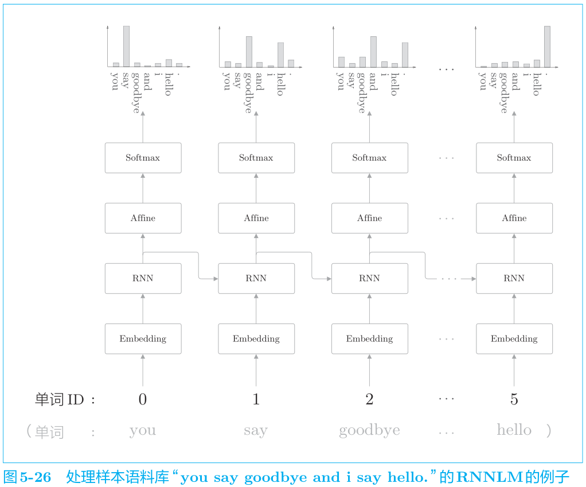

关注第 2 个单词 say。此时，Softmax 层的输出在 goodbye
处和 hello 处概率较高。确实，“you say goodby”和“you say hello”都是很自然的句子（正确答案是 goodbye）。说明RNN 层“记忆”了“you say”这一上下文。

RNN 层通过从过去到现在继承并传递数据，使得编码和存储过去的信息成为可能。

#### Time层的实现

同样使用 Time Embedding 层、Time Affine 层等来实现整体处理时序数据的层。

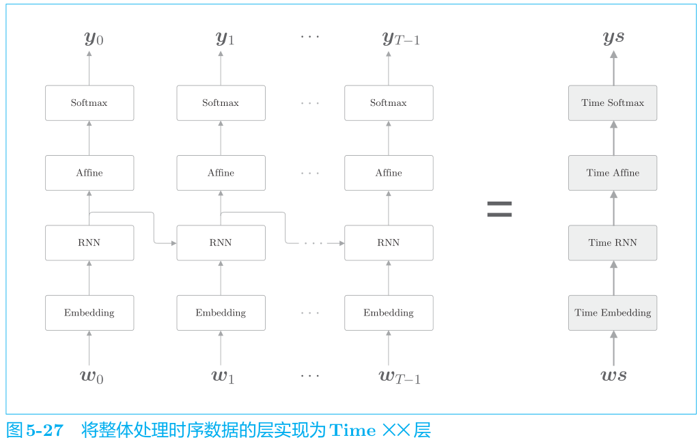

> 关于 Time Affine 层和 Time Embedding 层的实现，查看common/time_layers.py。
>
> 需要注意的是，Time Affine 层不是单纯地使用 T 个
> Affine 层，而是使用矩阵运算实现了高效的整体处理。

在 Softmax 中一并实现损失误差 Cross Entropy Error 层。这里，
按照图 5-29 所示的网络结构实现 Time Softmax with Loss 层。

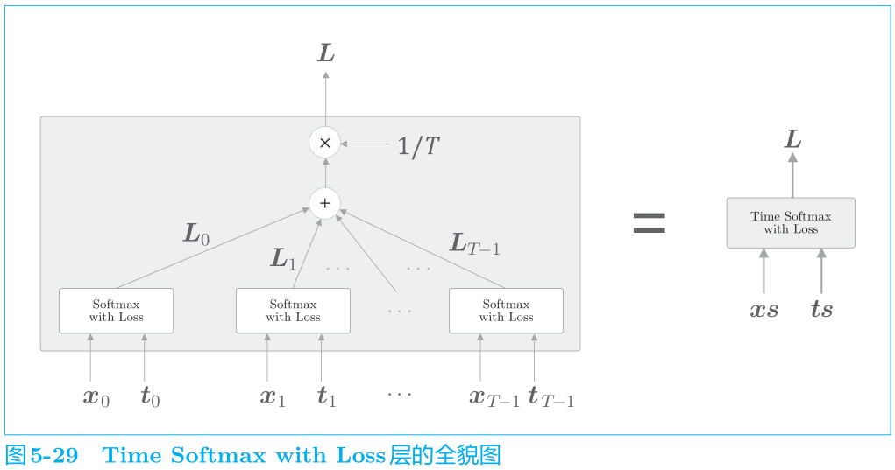

注意这里的1/T是求平均的含义。代码位于 common/time_layers.py 。

### RNNLM的学习和评价

#### RNNLM的实现

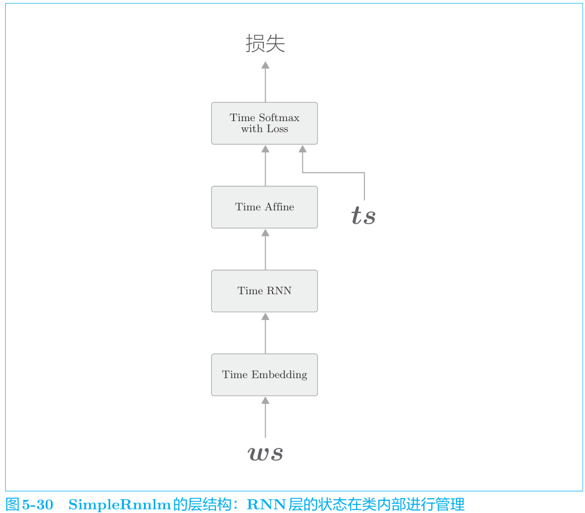

SimpleRnnlm 类是一个堆叠了 4 个 Time 层的神经网络。
初始化的代码（ ch05/simple_rnnlm.py）

```python
class SimpleRnnlm:
    def __init__(self, vocab_size, wordvec_size, hidden_size):
        V, D, H = vocab_size, wordvec_size, hidden_size
        rn = np.random.randn

        # RNN 层和 Affine 层使用了“Xavier 初始值”
        # 在上一层的节点数是 n 的情况下，使用标准差为1/√n的分布作为 Xavier 初始值
        
        # 初始化权重
        embed_W = (rn(V, D) / 100).astype('f')
        rnn_Wx = (rn(D, H) / np.sqrt(D)).astype('f')
        rnn_Wh = (rn(H, H) / np.sqrt(H)).astype('f')
        rnn_b = np.zeros(H).astype('f')
        affine_W = (rn(H, V) / np.sqrt(H)).astype('f')
        affine_b = np.zeros(V).astype('f')

        # 生成层
        self.layers = [
            TimeEmbedding(embed_W),
            TimeRNN(rnn_Wx, rnn_Wh, rnn_b, stateful=True),
            TimeAffine(affine_W, affine_b)
        ]
        self.loss_layer = TimeSoftmaxWithLoss()
        self.rnn_layer = self.layers[1]

        # 将所有的权重和梯度整理到列表中
        self.params, self.grads = [], []
        for layer in self.layers:
            self.params += layer.params
            self.grads += layer.grads
```

> 此后都将使用 Xavier 初始值作为权重的初始值。在语言模型的相关研究中，经常使用 0.01 * np.random.uniform(...)
> 这样的经过缩放的均匀分布。

forward，backward和reset_state函数都很简单，这里不进行赘述。

#### 语言模型的评价

语言模型基于给定的已经出现的单词（信息）输出将要出现的单词的概率分布。困惑度（perplexity）常被用作评价语言模型的预测性能的指标。

困惑度表示“概率的倒数”。

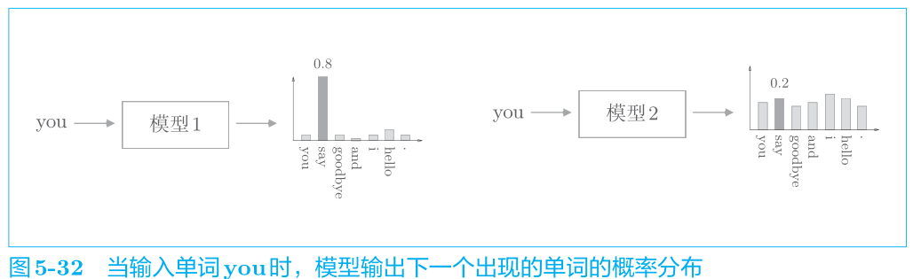

“模型 1”能准确地预测，困惑度是 1/0.8=1.25；“模型 2”的预测
未能命中，困惑度是 1/0.2=5.0。此例表明，困惑度越小越好。

> 如何直观地解释值 1.25 和 5.0 呢？

可以解释为“分叉度”。
所谓分叉度，是指下一个可以选择的选项的数量（下一个可能出现的单词的候选个数）。在刚才的例子中，好的预测模型的分叉度是 1.25，这意味着下
一个要出现的单词的候选个数可以控制在 1 个左右。而在差的模型中，下一
个单词的候选个数有 5 个。

以上都是输入数据为 1 个时的困惑度。在输入数据为多个的情况下，可以根据下面的式子进行计算
$$
\begin{array}{c}
L=-\frac{1}{N} \sum_{n} \sum_{k} t_{n k} \log y_{n k} \\
\text { 困惑度 }=\mathrm{e}^{L}
\end{array}
$$
假设数据量为 N 个。tn 是 one-hot 向量形式的正确解标签，tnk 表
示第 n 个数据的第 k 个值，ynk 表示概率分布（神经网络中的 Softmax 的
输出）。L 是神经网络的损失。 e^L 就是困惑度。

> 在信息论领域，困惑度也称为“平均分叉度”。这可以解释为，数据
> 量为 1 时的分叉度是数据量为 N 时的分叉度的平均值。

#### RNNLM的学习代码

使用 PTB 数据集进行学习，仅使用 PTB 数据集
（训练数据）的前 1000 个单词。

> ch05/train_custom_loop.py

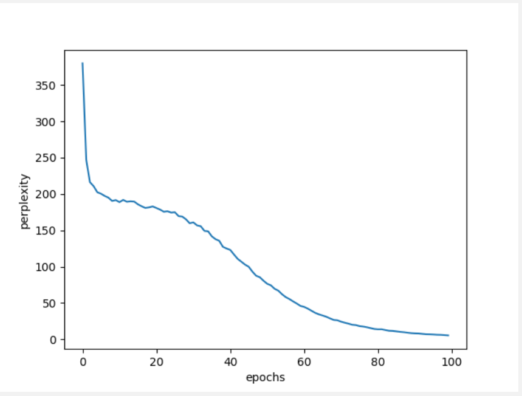

困惑度从 379.76 -> 5.49。

不过这里使用的是很小的语料库，在
实际情况下，当语料库增大时，现在的模型根本无法招架。

#### RNNLM的Trainer类

封装代码于  ch05/train.py

- 按顺序生成 mini-batch
- 调用模型的正向传播和反向传播
- 使用优化器更新权重
- 评价困惑度

### 小结

- RNN 具有环路，可以在内部记忆隐藏状态
- 通过展开 RNN 的循环，可以将其解释为多个 RNN 层连接起来的神
  经网络，可以通过常规的误差反向传播法进行学习（= BPTT）
- 在学习长时序数据时，要生成长度适中的数据块，进行以块为单位
  的 BPTT 学习（= Truncated BPTT）
- Truncated BPTT 只截断反向传播的连接
- 在 Truncated BPTT 中，为了维持正向传播的连接，需要按顺序输
  入数据
- 语言模型将单词序列解释为概率
- 理论上，使用 RNN 层的条件语言模型可以记忆所有已出现单词的信息

